# Index of figures_out

Pre-validation, pixel units. Every figure shows the default pipeline output (every switch off) unless its row says otherwise. Open first: **Fig02** (the network overlay of 543-2), then the network figure of any other image below, then Fig01 and Fig04. Captions: `figures/captions.md`. Review notes: `figures/REVIEW_V2.md`. How to regenerate: `README.md`.

Display window: "fixed" is one window for the whole dataset (`display_window.json`), so brightness can be compared between images; the per-image variants in `per_image/<image>/display_variants/` use each image's own window instead.

## Main figures

| figure | what it shows | window | file | thumbnail |
|---|---|---|---|---|
| Fig01 | All 8 sections with the kept lacunae (cyan interior, yellow frame edge), canal marks "c" and the count lines. | fixed | [png](main/Fig01_contact_sheet.png), [pdf](main/Fig01_contact_sheet.pdf) | [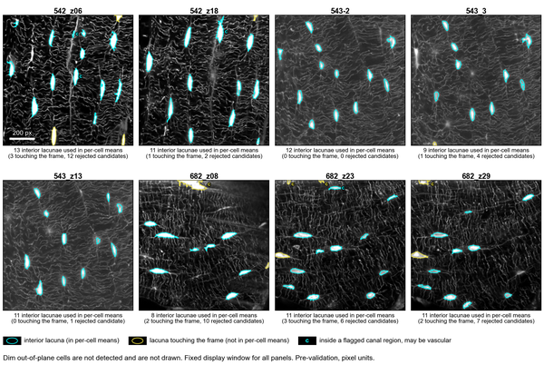](main/Fig01_contact_sheet.png) |
| Fig02 | Network overlay of 543-2: raw; overlay with vermillion ring 30 px skeleton, white rest, magenta roots; three lacunae at 3x. A copy of per_image/543-2/network. | fixed | [png](main/Fig02_network_overlay_543-2.png), [pdf](main/Fig02_network_overlay_543-2.pdf) | [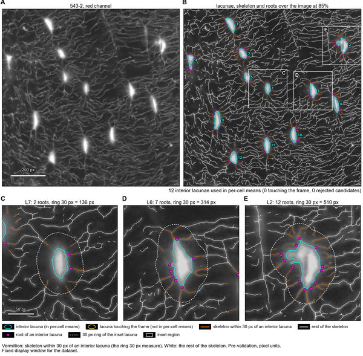](main/Fig02_network_overlay_543-2.png) |
| Fig03 | Kept lacunae and count lines at 0.8 to 1.2 times the lacuna cut t_hi, three sections; the default is framed. | fixed | [png](main/Fig03_threshold_sensitivity.png), [pdf](main/Fig03_threshold_sensitivity.pdf) | [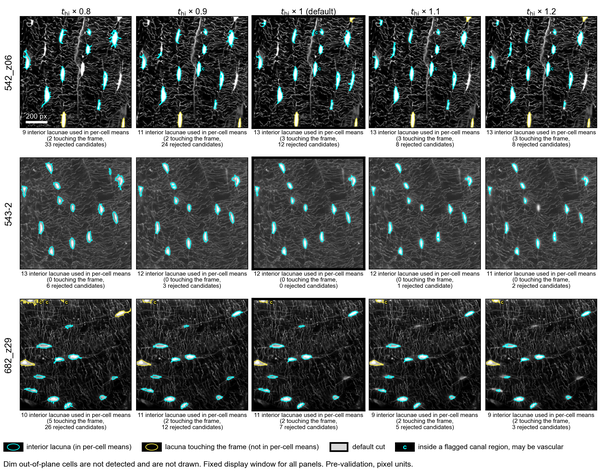](main/Fig03_threshold_sensitivity.png) |
| Fig04 | Roots, roots per 100 px perimeter, ring 30 px, ring density 30 px and field density by field; y from zero; 682_z08 open diamond. | none (no image) | [png](main/Fig04_per_field.png), [pdf](main/Fig04_per_field.pdf) | [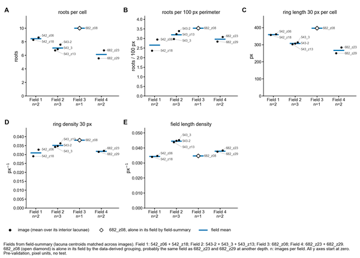](main/Fig04_per_field.png) |
| Fig04 merged | The same with 682_z08 merged by hand into Field 4 (option -m). | none (no image) | [png](main/Fig04_per_field_merged.png), [pdf](main/Fig04_per_field_merged.pdf) | [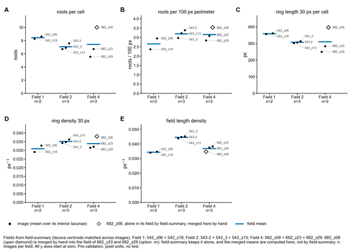](main/Fig04_per_field_merged.png) |

## Supplementary figures

| figure | what it shows | window | file | thumbnail |
|---|---|---|---|---|
| S01 | The narrow crumb rule (543_3) and the hole fill (542_z06), off and on, in the network overlay style. | fixed | [png](supplement/S01_switch_examples.png), [pdf](supplement/S01_switch_examples.pdf) | [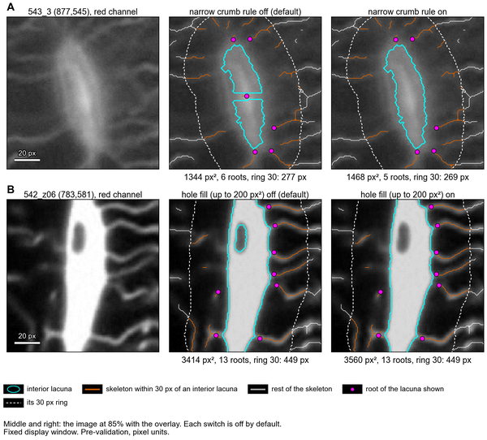](supplement/S01_switch_examples.png) |
| S02 | The contact sheet with the rejected lacuna-scale candidates (grey dashed; A aspect, S solidity, a area). | fixed | [png](supplement/S02_contact_sheet_with_rejected_candidates.png), [pdf](supplement/S02_contact_sheet_with_rejected_candidates.pdf) | [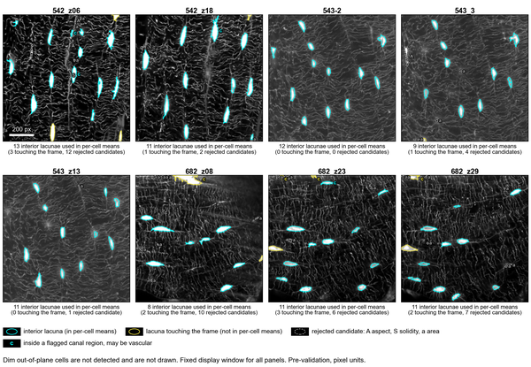](supplement/S02_contact_sheet_with_rejected_candidates.png) |
| S03 | The contact sheet labelled with blinding codes (a blinding test). | fixed | [png](supplement/S03_contact_sheet_coded.png), [pdf](supplement/S03_contact_sheet_coded.pdf) | [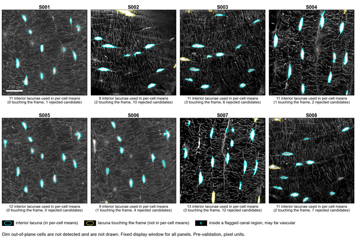](supplement/S03_contact_sheet_coded.png) |

## Per image

`overview`: raw; kept lacunae with numbers, canal marks and rejected candidates; the network overlay at small size; one inset lacuna at 3x. `network`: raw and the network overlay at full size with three lacunae at 3x. `gallery`: every interior lacuna at 3x. All three use the fixed window; `display_variants/` holds the same three with the image's own window (PNG). `inset.json` logs the inset choices; `network_check.json` and `gallery_check.json` list the drawn numbers against the pipeline numbers.

| image | overview | network | gallery |
|---|---|---|---|
| 543-2 | [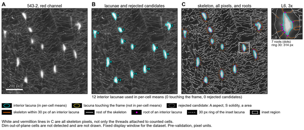](per_image/543-2/overview.png) [pdf](per_image/543-2/overview.pdf) |  [pdf](per_image/543-2/network.pdf) | [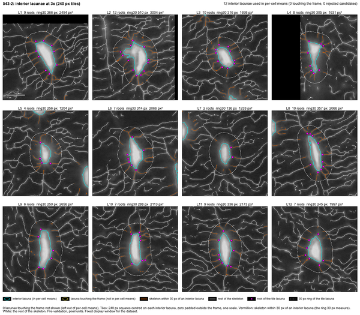](per_image/543-2/gallery.png) [pdf](per_image/543-2/gallery.pdf) |
| 543_3 | [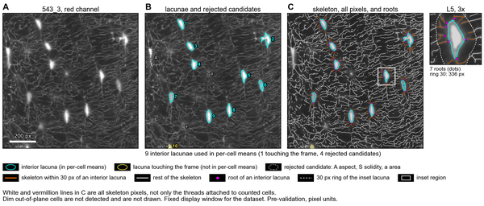](per_image/543_3/overview.png) [pdf](per_image/543_3/overview.pdf) | [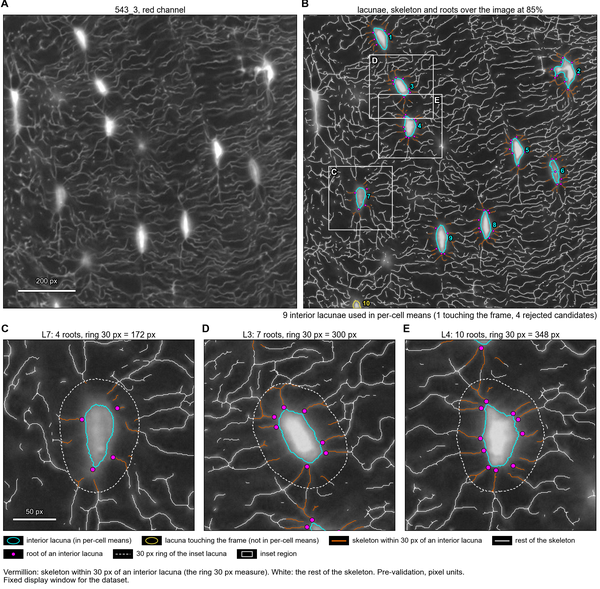](per_image/543_3/network.png) [pdf](per_image/543_3/network.pdf) | [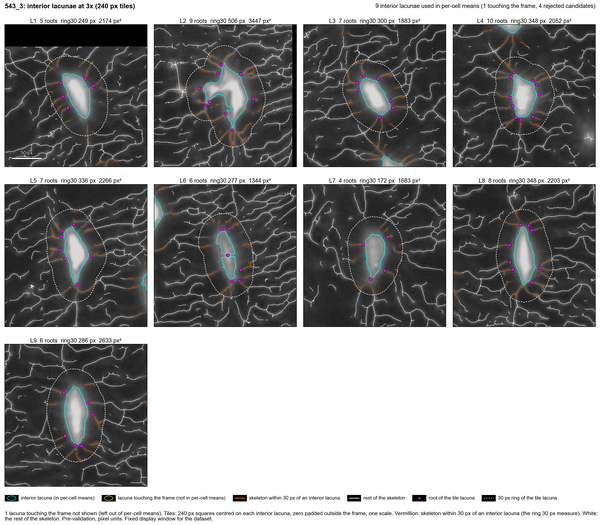](per_image/543_3/gallery.png) [pdf](per_image/543_3/gallery.pdf) |
| 543_z13 | [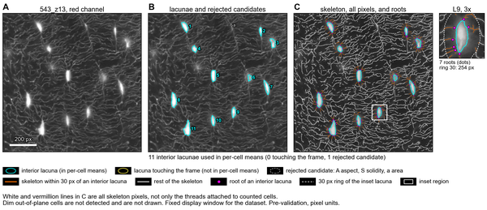](per_image/543_z13/overview.png) [pdf](per_image/543_z13/overview.pdf) | [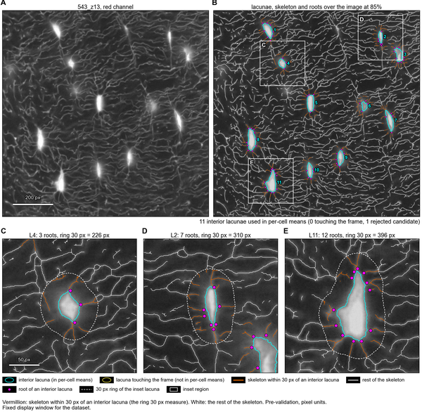](per_image/543_z13/network.png) [pdf](per_image/543_z13/network.pdf) | [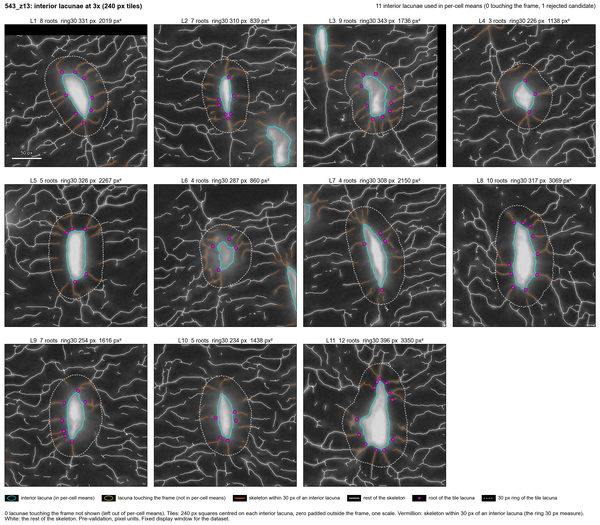](per_image/543_z13/gallery.png) [pdf](per_image/543_z13/gallery.pdf) |
| 542_z06 | [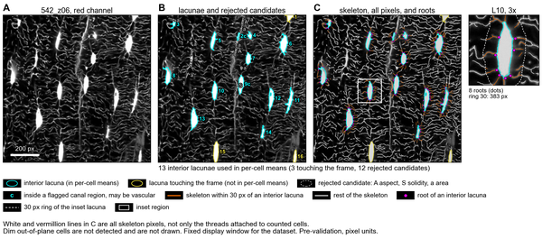](per_image/542_z06/overview.png) [pdf](per_image/542_z06/overview.pdf) | [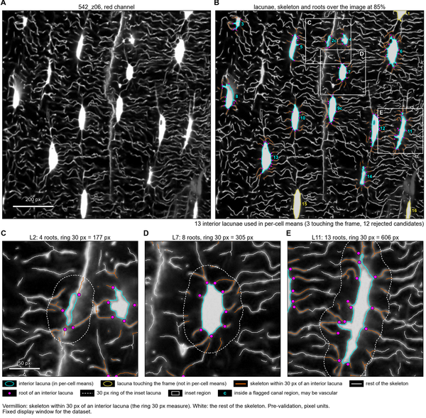](per_image/542_z06/network.png) [pdf](per_image/542_z06/network.pdf) | [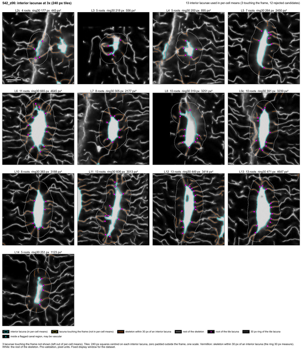](per_image/542_z06/gallery.png) [pdf](per_image/542_z06/gallery.pdf) |
| 542_z18 | [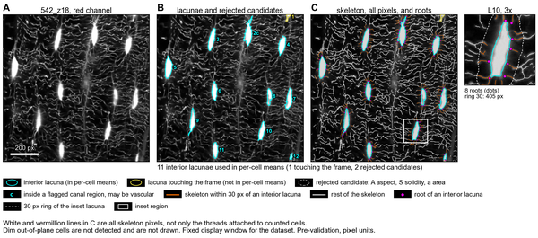](per_image/542_z18/overview.png) [pdf](per_image/542_z18/overview.pdf) | [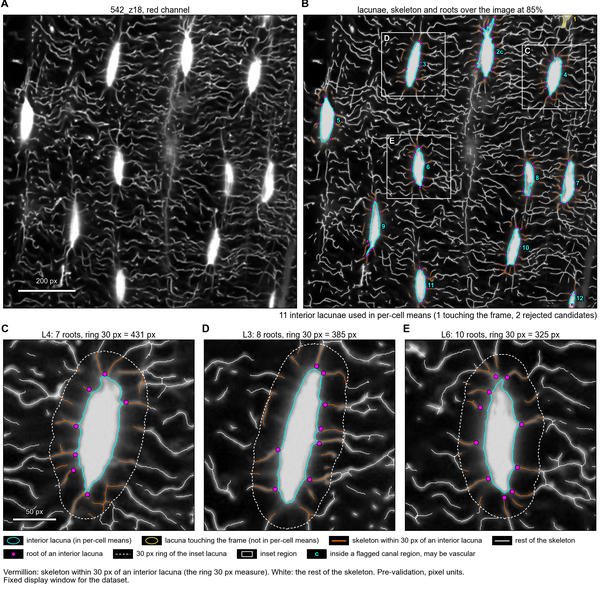](per_image/542_z18/network.png) [pdf](per_image/542_z18/network.pdf) | [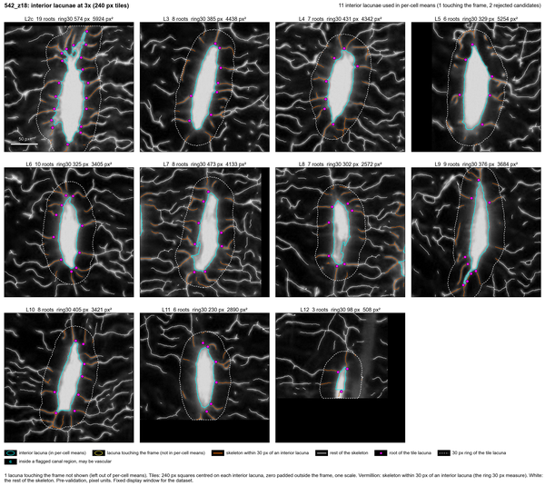](per_image/542_z18/gallery.png) [pdf](per_image/542_z18/gallery.pdf) |
| 682_z08 | [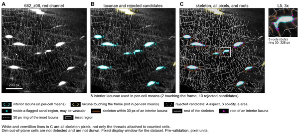](per_image/682_z08/overview.png) [pdf](per_image/682_z08/overview.pdf) | [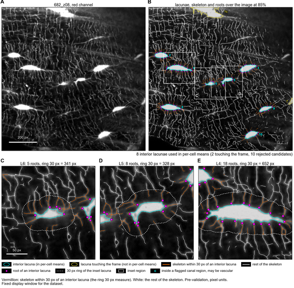](per_image/682_z08/network.png) [pdf](per_image/682_z08/network.pdf) | [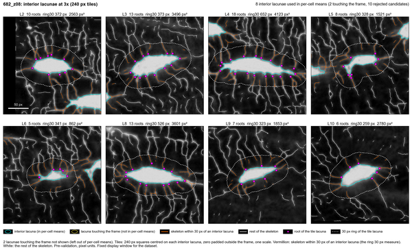](per_image/682_z08/gallery.png) [pdf](per_image/682_z08/gallery.pdf) |
| 682_z23 | [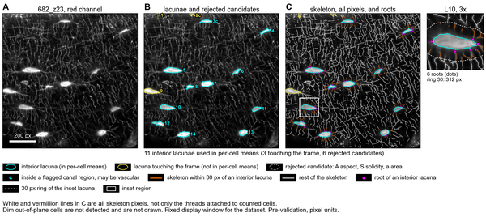](per_image/682_z23/overview.png) [pdf](per_image/682_z23/overview.pdf) | [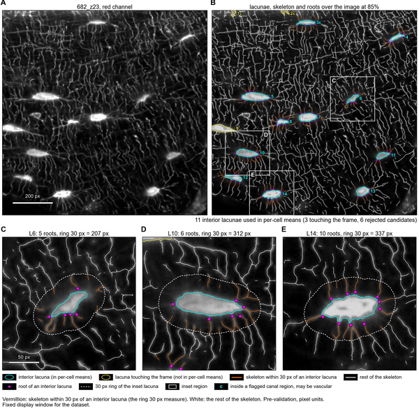](per_image/682_z23/network.png) [pdf](per_image/682_z23/network.pdf) | [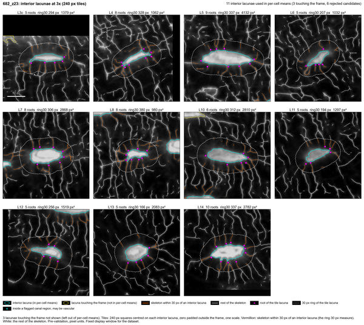](per_image/682_z23/gallery.png) [pdf](per_image/682_z23/gallery.pdf) |
| 682_z29 | [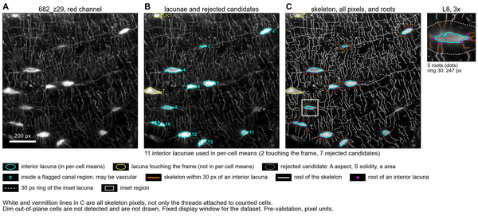](per_image/682_z29/overview.png) [pdf](per_image/682_z29/overview.pdf) | [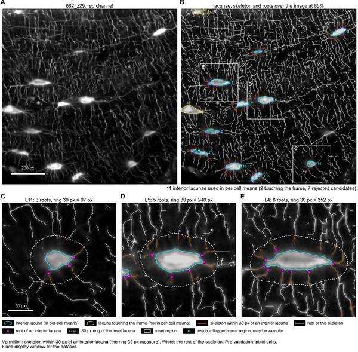](per_image/682_z29/network.png) [pdf](per_image/682_z29/network.pdf) | [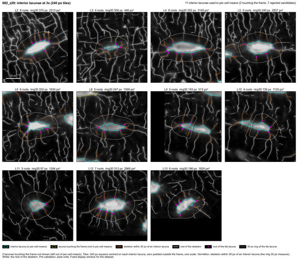](per_image/682_z29/gallery.png) [pdf](per_image/682_z29/gallery.pdf) |

Also: `per_image/543_3/overview_low_cut_layer` (option `-r`: objects kept only at 0.8 times t_hi, dotted light blue; not the default output).

## Hand-count tiles

`validation_tiles/`: 86 raw red tiles, one per interior lacuna, under random codes, for counting roots by hand without seeing the pipeline result. See `validation_tiles/README.md`. The key is outside the repository.
