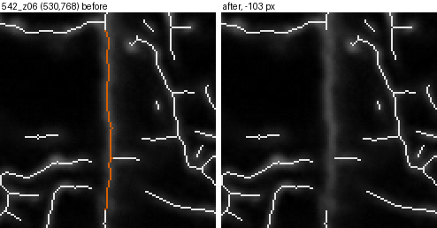
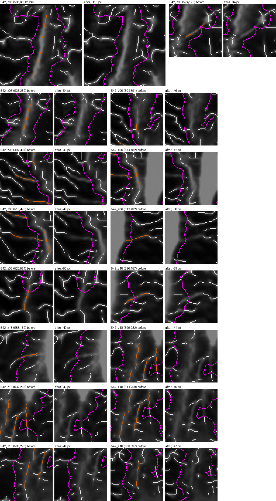

# Canaliculi v2 report, 2026-10-03

**Pre-validation, pixel units.** Branch `canaliculi-v2`, started from `origin/publication-fixes` (8673380,
tag `before-canaliculi-v2`). This run worked on the canalicular part of the pipeline (`src/canaliculi.py`
and the measures built on it). **No default changed**: every new number is an appended column, and the one
new behaviour (the band-wall filter) is a switch that is off and has no recommended value. With every switch
off, `python src/diagnostics.py regression` reproduces `results/` at tolerance 0 (3861 numbers, with the
original and the fast lacuna stage), and it now fails on any new field that is not in its printed
allowlist. There is no ground truth, so nothing here says a change is more accurate. `figures/`,
`figures_out/`, `results/`, `docs/METHODS.md` and `README.md` are unchanged, so this branch and
`figures-v2` can be merged without conflicts.

Stage map with every parameter and its origin: `docs/CANALICULI_AUDIT.md`. Every output:
`results_experiments/canal_v2/INDEX.md`.

## Summary

- **Four additive measures** answer three known flaws of the ring and length measures: the attached ring
  length (threads that touch the cell, not passing threads), chain code lengths ($\sqrt{2}$ per diagonal
  step), Sholl crossings (threads crossing a circle, without the graph), and field density without the
  flagged canal regions or inside a bone ROI.
- **The 542_z06 band wall is not separable** by a straight-line filter: the line is straight only in pieces,
  and every setting that catches it either catches a quarter of it far from the canal mask or also removes
  ordinary threads. The switch `BAND_LINE_FILTER` exists, is off, has no recommended value, and refuses to
  run until its two values are set deliberately.
- **What moves which measure** (network sweep): the hysteresis fraction and the cut $t_\mathrm{lo}$ move every
  measure by about 7 to 17%, the top-hat radius up to about 10%; the graph and attach parameters move only
  roots (up to 15%) and the attached ring; **the bridging parameters move no headline measure by more than
  1.7% in any image** (median at most 1.0%), and switching bridging off moves them by at most 1.4%. The
  Sholl crossings are untouched by the graph parameters, so they are more robust than roots.
- **A validation harness** (`validate-network`) and a **tuning protocol** are ready for the day blind hand
  counts exist; the hand-count tiles of branch figures-v2 are its input.

## New columns

All appended after every existing column; existing columns keep name, order and value. Per-lacuna columns
are in `canaliculi_measurements.json` and the `per_lacuna` sheet, their interior means in the summary and in
`summary_table.csv` / `.xlsx`; field values in the `field` block and the summary table.

| name | definition | why |
|---|---|---|
| `ring_attached_length_r30_px`, `_r60_px` | ring length pixels (same pixel set as `ring_length_rR_px`) in 8-connected components of the ring that reach within `LACUNA_ATTACH_GAP_PX` (10 px) of the lacuna | ring length counts threads that only pass by; 72.9% of ring 30 px is attached (per cell 36.7 to 95.4%) |
| `ring_length_w_r30_px`, `_r60_px` | chain code length of the ring: 1 per orthogonal link, $\sqrt{2}$ per diagonal link, a link in the ring of its first pixel in raster order | the pixel count makes diagonal threads 29.3% short |
| `field_length_density_w_per_px` | chain code length of the skeleton over the analysed area | as above; 1.117 to 1.134 times the pixel-count density, image order unchanged |
| `sholl_crossings_r10`, `_r20`, `_r30` | 8-connected skeleton components inside the band $[R - 0.75, R + 0.75)$ px from the lacuna, in its nearest-lacuna partition | a thread count that uses no graph, no cleanup and no attach gap; Spearman with roots 0.90 at 10 px |
| `field_density_without_flagged_per_px` | skeleton px outside the flagged canal mask over the analysed area outside it | the canal regions hold 3 to 9% of the skeleton in 5 images; changes density -1.6 to +1.1%, equal to overnight 5.1 |
| `field_density_in_roi_per_px` | skeleton px inside a bone ROI over the analysed area inside it; only with `-m DIR` on `src/canaliculi.py`, None otherwise | no ROI is applied by default and the draft ROI is not used |

Also new: the `parameters` block records `band_line_filter`, `band_line_min_len_px`, `band_line_reach_px` and
`band_line_remove_px`; `canaliculi.analyse_network` runs the network stage from a lacuna result (used by the
sweep; `analyse_image` calls it, regression passes). Chain code links use mixed adjacency: a diagonal link is
left out when its two pixels share an orthogonal skeleton neighbour (Decisions needed 1).

## The switch

| name | default | recommended value | what changes when on | evidence |
|---|---|---|---|---|
| `BAND_LINE_FILTER` (with `BAND_LINE_MIN_LEN_PX`, `BAND_LINE_REACH_PX`, `BAND_LINE_REMOVE_PX` = 2) | False (values None) | none | skeleton within 2 px of straight runs near the canal mask removed, bridges closed there; at L 97 px, reach 66 px: 103 px of 542_z06 only (density -0.29%); at L 40 px, reach 0: 4164 px in 5 images (density down to -4.55%) | `B1_straight_runs.md`, `B1_filter.md`, `B1_switch_check.md` |

The three earlier switches (`NARROW_CRUMB_RULE`, `FILL_ENCLOSED_HOLES_MAX_PX2`,
`BAND_FILTER_MIN_OPENING_SHARE`) and `FAST_LACUNA_STAGE` are unchanged, and `switch-check` gives the same
result for them as on publication-fixes.

## The band wall (B1)

**Evidence first.** For every image and line lengths L from 40 to 300 px, the skeleton widened to 3 px
was opened with one-pixel lines at 24 orientations; the surviving pixels form straight objects
(`B1_straight_runs.csv`). Findings:

- The 542_z06 line (x 515 to 541, y 590 to 900, about 380 skeleton px) is straight only in pieces at a
  3 px tolerance: its longest straight object is 139 px, and nothing of it survives at L 105.
- Its straight part touches the flagged canal mask only at L 40. At L 40, 66 other straight objects touch a
  canal mask too, in 5 images.
- A gap in L exists (other objects survive up to L 90, the line up to L 100), but in it the line's straight
  piece is 102 px long, holds 103 skeleton px within 2 px, and lies 65.01 px from the canal mask: it does not
  continue the canal region.

**Decision.** Not separable as intended; the switch stays off and no value is recommended.

**What it does if turned on** (`B1_filter.md`, crops `B1_crops_*.png`). At L 97 px with reach 66 px it
removes one straight 103 px piece of the 542_z06 line and nothing else (field density -0.29%; roots, ring
30 px and bridges unchanged). At L 40 px with reach 0 it removes 68 pieces in 5 images: wall pieces inside
the canal masks of 542_z06 and 542_z18, but mostly ordinary threads that touch a canal mask, many of them
lattice threads of the 682 images (682_z29 field density -4.55%). The expected result (about 380 px from
542_z06 only, density about -1.1%) is reached by neither; nothing was adjusted.

| before and after, L 97 px | one of 68 pieces at L 40 px |
|---|---|
|  |  |

## The network sweep (S1)

`python src/diagnostics.py network-sweep -d data/WT -o OUT` sets one parameter at a time to a low and a high
value (about -30% and +30%, integer steps where needed; the bridge gap also at 0) with the lacuna stage run
once per image. Full tables: `S1_network_sweep.md`. The $t_\mathrm{lo}$ rows equal the overnight grid
(field density +11.1% at 0.8, -8.2% at 1.2).

- The **mask and the cut** (hysteresis low fraction, $t_\mathrm{lo}$, top-hat radius) move every measure:
  ring 30 px, the weighted ring, field density and the Sholl crossings by up to 13.7%, roots by up to 9.5%.
- The **graph and attach parameters** (spur length, root merge distance, attach gap) move roots by up to
  15.3% (attach gap 13 px) and the attached ring by up to 10.6%, and nothing else.
- **Bridging**: its parameters move the bridge count by up to about sixfold (minimum signal 0.49) but no
  headline measure by more than 1.7% in any image (median at most 1.0%).
- **Sholl crossings against roots**: both respond to the mask and the cut by similar amounts (roots at most
  -9.5%, Sholl 10 px at most -12.1%, both at a hysteresis fraction of 0.975), but the Sholl crossings do not
  move with the graph and attach parameters while roots move by up to 15.3%. The Sholl crossings at 20 and
  30 px are the least sensitive measures overall; the bridge count is the most sensitive, then the attached
  ring and roots.

No value is recommended.

## The bridging audit (S2)

143 bridges over the 8 images (`S2_bridges.csv`; 21 in 543-2, as the reference check), median gap 4 to 5.7
px, angle median 11 to 22 degrees, minimum signal about 0.72 of $t_\mathrm{lo}$ (the test is 0.7), mean signal
0.78 to 0.99. The gap pixels are 0.12 to 0.26% of the skeleton. Without bridging (sweep, gap 0): roots per
cell -1.35 to 0% (bridging lowers roots slightly in three images, where joined threads merge attachment
points), ring 30 px 0 to +0.36%, field density +0.11 to +0.23%, Sholl 10 px unchanged. So under 1.4% of any
headline measure depends on bridging in these images. One crop sheet per image: `S2_bridges_<image>.png`.

## Validation harness (V1) and tuning protocol (V2)

`python src/diagnostics.py validate-network -a ANNOTATION.csv -k KEY.csv -r RESULTS -o OUT [-t TRACES -b BOXES.csv]`
joins blind hand counts to the pipeline through the key (refused inside the repository) and reports, for
roots and the Sholl crossings at 10 and 20 px against hand roots: n, bias, SD, limits of agreement, mean
absolute error, share equal, share within one, Spearman; over all lacunae, per image and per field; a
Bland-Altman PNG; and with traces, precision, recall and F1 of the skeleton at 3 px. The self-test (`-s`) on
synthetic data passed 8 of 8 checks (bias -0.023, F1 1.000, a wrong-image negative control 0.257, key
refusal). `docs/NETWORK_TUNING_PROTOCOL.md` fixes the grid, the metrics, the split by whole fields and the
decision rule before any count exists.

**How to run it on the hand counts.** Count the tiles of `figures_out/validation_tiles/` (branch
figures-v2) blind into `annotation_template.csv`; run the pipeline of this branch into a folder (for the
Sholl columns); then run the command above with the tiles key, which stays outside the repository. To send:
the filled annotation CSV (codes and counts only; it carries no image name), and, if traced, the trace PNGs
and the boxes CSV.

## What remains blocked

- **Ground truth for every threshold.** No hand counts or traces exist; no network parameter can be judged.
- **Calibration.** No µm/px value; everything is in pixels.
- **The POL definition.** No Hyp images; the canal and lacuna gates and this branch's measures are WT only.
- **Animal IDs and acquisition settings**, which decide the unit of analysis and between image-relative and
  pooled cuts.
- **Repository visibility.** The crops show unpublished images.

## Decisions needed

1. **Mixed adjacency in the chain code length.** The brief defines the length over the 8-connected pixel
   graph but asserts 198 for an L of two 100 px arms; with every 8-neighbour pair the L measures
   $198 + \sqrt{2}$. The diagonal link at a corner is left out when the two pixels share an orthogonal
   skeleton neighbour; components are unchanged; the plain 8-link totals are in `C2_chain_length.csv`.
2. **The band wall.** Keep the line (counted now), exclude it by hand, or find another rule; the straight-line
   filter does not do it. Wall pieces inside the canal masks of 542_z06 and 542_z18 are also counted now.
3. **Which per-cell measure to validate first**: roots per cell or the Sholl crossings at 10 px (more robust
   to the graph parameters, Spearman 0.90 with roots).
4. **Attached ring and the attach gap.** The attached ring leaves out threads that end more than 10 px from
   the body (a gap in the mask next to the bright rim), not only passing threads (C1 crops).
5. **ROI file names.** `-m` accepts the clean or the short image name; the short names of the 8 WT images are
   a table in `src/canaliculi.py` (`ROI_SHORT_NAMES`), the same names as the reports and the tiles key.
6. **Evidence settings in `switch-check`.** The band-wall filter is run at two labelled evidence settings
   because it has no recommended value.
7. **Keys.** The tiles key (`F:/lcn-quant-keys/validation_tiles_key.csv`, branch figures-v2) is needed to
   unblind the hand counts; back it up.

## Lines to append later to docs/METHODS.md and README.md

Not edited on this branch, so that it merges with figures-v2 without conflicts.

- METHODS, measures table: "`ring_attached_length_r30_px`: ring 30 px pixels in threads that reach within
  10 px of the lacuna (passing threads left out)."
- METHODS, measures table: "`ring_length_w_r30_px`, `field_length_density_w_per_px`: chain code lengths,
  $\sqrt{2}$ per diagonal step (mixed adjacency)."
- METHODS, measures table: "`sholl_crossings_r10/20/30`: skeleton components crossing a 1.5 px band at 10, 20,
  30 px from the lacuna; no graph."
- METHODS, measures table: "`field_density_without_flagged_per_px`; `field_density_in_roi_per_px` with
  `-m DIR`."
- METHODS, section 9 switches: "`BAND_LINE_FILTER` (False, values None): straight band-wall filter; no
  recommended value (docs/CANALICULI_V2_REPORT.md)."
- METHODS, section 9 subcommands: "`network-sweep`: one network parameter at a time; `validate-network`:
  pipeline against blind hand counts and traces (`-s` self-test)."
- README, checks: "`python src/diagnostics.py validate-network -s`" and a pointer to
  `docs/NETWORK_TUNING_PROTOCOL.md`.

## Final commit and links

Final content commit: `6d6ed81c4f57e78c63c8dd39af298dad31aae8b8`. It is the last commit that changed any code, table, crop or report text; the
commit after it only adds this list, and the next one marks PROGRESS_CANAL.md done. Every link below is
pinned to it.

- [docs/CANALICULI_V2_REPORT.md](https://raw.githubusercontent.com/Kimokazi-coder/xlh-lcn-pipeline/6d6ed81c4f57e78c63c8dd39af298dad31aae8b8/docs/CANALICULI_V2_REPORT.md)
- [results_experiments/canal_v2/INDEX.md](https://raw.githubusercontent.com/Kimokazi-coder/xlh-lcn-pipeline/6d6ed81c4f57e78c63c8dd39af298dad31aae8b8/results_experiments/canal_v2/INDEX.md)
- [docs/CANALICULI_AUDIT.md](https://raw.githubusercontent.com/Kimokazi-coder/xlh-lcn-pipeline/6d6ed81c4f57e78c63c8dd39af298dad31aae8b8/docs/CANALICULI_AUDIT.md)
- [docs/NETWORK_TUNING_PROTOCOL.md](https://raw.githubusercontent.com/Kimokazi-coder/xlh-lcn-pipeline/6d6ed81c4f57e78c63c8dd39af298dad31aae8b8/docs/NETWORK_TUNING_PROTOCOL.md)
- [experiments/PROGRESS_CANAL.md](https://raw.githubusercontent.com/Kimokazi-coder/xlh-lcn-pipeline/6d6ed81c4f57e78c63c8dd39af298dad31aae8b8/experiments/PROGRESS_CANAL.md)
- [config.py](https://raw.githubusercontent.com/Kimokazi-coder/xlh-lcn-pipeline/6d6ed81c4f57e78c63c8dd39af298dad31aae8b8/config.py)
- [results_experiments/canal_v2/R1_checks.md](https://raw.githubusercontent.com/Kimokazi-coder/xlh-lcn-pipeline/6d6ed81c4f57e78c63c8dd39af298dad31aae8b8/results_experiments/canal_v2/R1_checks.md)
- [results_experiments/canal_v2/REVIEW.md](https://raw.githubusercontent.com/Kimokazi-coder/xlh-lcn-pipeline/6d6ed81c4f57e78c63c8dd39af298dad31aae8b8/results_experiments/canal_v2/REVIEW.md)
- [results_experiments/canal_v2/C1_attached_ring.md](https://raw.githubusercontent.com/Kimokazi-coder/xlh-lcn-pipeline/6d6ed81c4f57e78c63c8dd39af298dad31aae8b8/results_experiments/canal_v2/C1_attached_ring.md)
- [results_experiments/canal_v2/C1_attached_ring.csv](https://raw.githubusercontent.com/Kimokazi-coder/xlh-lcn-pipeline/6d6ed81c4f57e78c63c8dd39af298dad31aae8b8/results_experiments/canal_v2/C1_attached_ring.csv)
- [results_experiments/canal_v2/C2_chain_length.md](https://raw.githubusercontent.com/Kimokazi-coder/xlh-lcn-pipeline/6d6ed81c4f57e78c63c8dd39af298dad31aae8b8/results_experiments/canal_v2/C2_chain_length.md)
- [results_experiments/canal_v2/C2_chain_length.csv](https://raw.githubusercontent.com/Kimokazi-coder/xlh-lcn-pipeline/6d6ed81c4f57e78c63c8dd39af298dad31aae8b8/results_experiments/canal_v2/C2_chain_length.csv)
- [results_experiments/canal_v2/C3_sholl.md](https://raw.githubusercontent.com/Kimokazi-coder/xlh-lcn-pipeline/6d6ed81c4f57e78c63c8dd39af298dad31aae8b8/results_experiments/canal_v2/C3_sholl.md)
- [results_experiments/canal_v2/C3_sholl.csv](https://raw.githubusercontent.com/Kimokazi-coder/xlh-lcn-pipeline/6d6ed81c4f57e78c63c8dd39af298dad31aae8b8/results_experiments/canal_v2/C3_sholl.csv)
- [results_experiments/canal_v2/C4_density.md](https://raw.githubusercontent.com/Kimokazi-coder/xlh-lcn-pipeline/6d6ed81c4f57e78c63c8dd39af298dad31aae8b8/results_experiments/canal_v2/C4_density.md)
- [results_experiments/canal_v2/C4_density.csv](https://raw.githubusercontent.com/Kimokazi-coder/xlh-lcn-pipeline/6d6ed81c4f57e78c63c8dd39af298dad31aae8b8/results_experiments/canal_v2/C4_density.csv)
- [results_experiments/canal_v2/B1_straight_runs.md](https://raw.githubusercontent.com/Kimokazi-coder/xlh-lcn-pipeline/6d6ed81c4f57e78c63c8dd39af298dad31aae8b8/results_experiments/canal_v2/B1_straight_runs.md)
- [results_experiments/canal_v2/B1_straight_runs.csv](https://raw.githubusercontent.com/Kimokazi-coder/xlh-lcn-pipeline/6d6ed81c4f57e78c63c8dd39af298dad31aae8b8/results_experiments/canal_v2/B1_straight_runs.csv)
- [results_experiments/canal_v2/B1_filter.md](https://raw.githubusercontent.com/Kimokazi-coder/xlh-lcn-pipeline/6d6ed81c4f57e78c63c8dd39af298dad31aae8b8/results_experiments/canal_v2/B1_filter.md)
- [results_experiments/canal_v2/B1_filter_components.csv](https://raw.githubusercontent.com/Kimokazi-coder/xlh-lcn-pipeline/6d6ed81c4f57e78c63c8dd39af298dad31aae8b8/results_experiments/canal_v2/B1_filter_components.csv)
- [results_experiments/canal_v2/B1_switch_check.md](https://raw.githubusercontent.com/Kimokazi-coder/xlh-lcn-pipeline/6d6ed81c4f57e78c63c8dd39af298dad31aae8b8/results_experiments/canal_v2/B1_switch_check.md)
- [results_experiments/canal_v2/S1_network_sweep.md](https://raw.githubusercontent.com/Kimokazi-coder/xlh-lcn-pipeline/6d6ed81c4f57e78c63c8dd39af298dad31aae8b8/results_experiments/canal_v2/S1_network_sweep.md)
- [results_experiments/canal_v2/S1_network_sweep.csv](https://raw.githubusercontent.com/Kimokazi-coder/xlh-lcn-pipeline/6d6ed81c4f57e78c63c8dd39af298dad31aae8b8/results_experiments/canal_v2/S1_network_sweep.csv)
- [results_experiments/canal_v2/S2_bridging.md](https://raw.githubusercontent.com/Kimokazi-coder/xlh-lcn-pipeline/6d6ed81c4f57e78c63c8dd39af298dad31aae8b8/results_experiments/canal_v2/S2_bridging.md)
- [results_experiments/canal_v2/S2_bridges.csv](https://raw.githubusercontent.com/Kimokazi-coder/xlh-lcn-pipeline/6d6ed81c4f57e78c63c8dd39af298dad31aae8b8/results_experiments/canal_v2/S2_bridges.csv)
- [results_experiments/canal_v2/V1_validate_network.md](https://raw.githubusercontent.com/Kimokazi-coder/xlh-lcn-pipeline/6d6ed81c4f57e78c63c8dd39af298dad31aae8b8/results_experiments/canal_v2/V1_validate_network.md)
- [results_experiments/canal_v2/C1_crops.png](https://raw.githubusercontent.com/Kimokazi-coder/xlh-lcn-pipeline/6d6ed81c4f57e78c63c8dd39af298dad31aae8b8/results_experiments/canal_v2/C1_crops.png)
- [results_experiments/canal_v2/C3_crops.png](https://raw.githubusercontent.com/Kimokazi-coder/xlh-lcn-pipeline/6d6ed81c4f57e78c63c8dd39af298dad31aae8b8/results_experiments/canal_v2/C3_crops.png)
- [results_experiments/canal_v2/B1_crops_L97_reach66_1.png](https://raw.githubusercontent.com/Kimokazi-coder/xlh-lcn-pipeline/6d6ed81c4f57e78c63c8dd39af298dad31aae8b8/results_experiments/canal_v2/B1_crops_L97_reach66_1.png)
- [results_experiments/canal_v2/B1_crops_L40_reach0_1.png](https://raw.githubusercontent.com/Kimokazi-coder/xlh-lcn-pipeline/6d6ed81c4f57e78c63c8dd39af298dad31aae8b8/results_experiments/canal_v2/B1_crops_L40_reach0_1.png)
- [results_experiments/canal_v2/S2_bridges_542_z06.png](https://raw.githubusercontent.com/Kimokazi-coder/xlh-lcn-pipeline/6d6ed81c4f57e78c63c8dd39af298dad31aae8b8/results_experiments/canal_v2/S2_bridges_542_z06.png)
- [results_experiments/canal_v2/S2_bridges_543-2.png](https://raw.githubusercontent.com/Kimokazi-coder/xlh-lcn-pipeline/6d6ed81c4f57e78c63c8dd39af298dad31aae8b8/results_experiments/canal_v2/S2_bridges_543-2.png)
