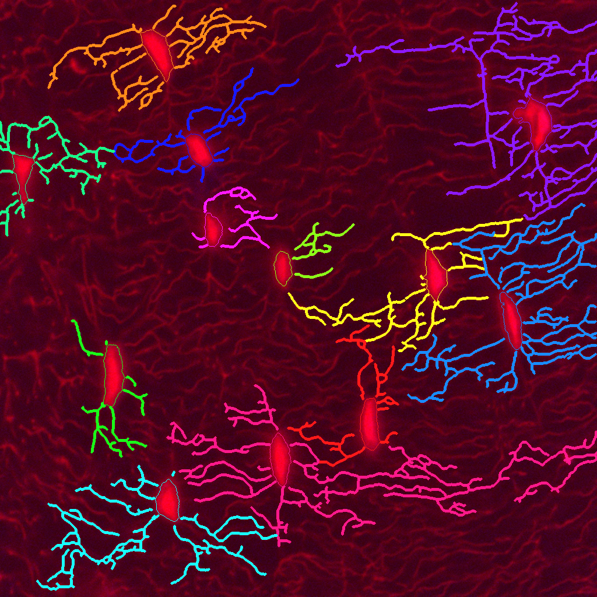
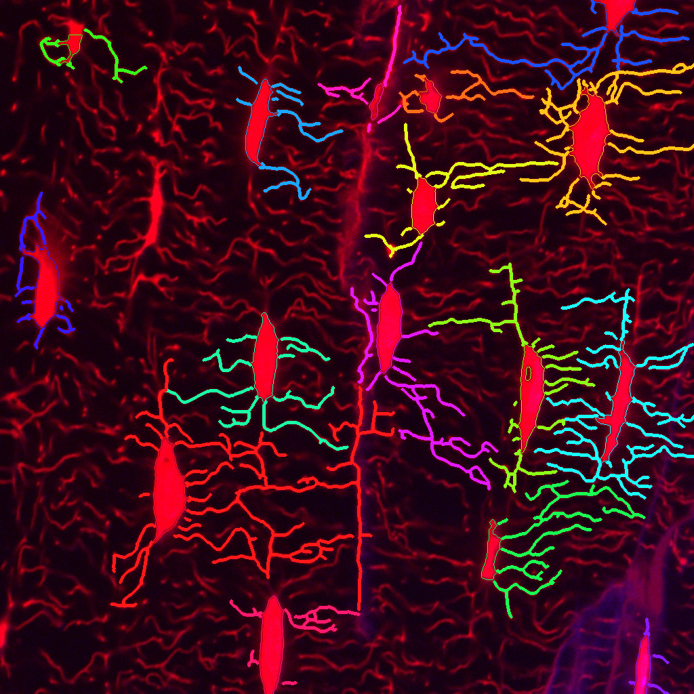

# Figures v2 report, 2026-10-02

**Paths.** Written before the results layout of 2026-10-05, which moved every result and figure into `results/` (guide: [results/README.md](../../results/README.md); every old and new path: [results/RENAMES.csv](../../results/RENAMES.csv)). Links pinned to a commit keep the old paths.

**Pre-validation, pixel units.** Branch `figures-v2`, started from `publication-fixes` (8673380). This
run changed figures only. `src/`, `config.py` and `requirements.txt` are identical to the base, and
`results/` was not touched. Before every push, `reference-check` passed (62.33 edges per cell, 27.41 px,
21 bridges), `git diff 8673380 -- src config.py requirements.txt` printed nothing and `git status
results/` was clean; `regression` passed before the final push. Every figure shows the default pipeline
output (every switch off) unless its caption says otherwise. There is no ground truth, so no figure
claims a more accurate result: the figures show the pipeline output as it is.

## Summary

- **A new canalicular overlay** (`figures_out/per_image/<image>/network`, and `main/Fig02` for 543-2;
  now `results/<label>/3_publication_figures/<label>_figure_network`).
  The whole skeleton is drawn as one-pixel vector lines over the image at 85%. Vermillion marks exactly
  the pixels counted in ring length 30 px of interior lacunae, white the rest, magenta dots exactly the
  counted roots. No colour stands for a cell, so no ownership is implied. Three lacunae per image at 3x
  show the 30 px ring as a dashed contour.
- **A cell gallery** per image (every interior lacuna at the same scale) and **86 hand-count tiles**
  (raw red only, random codes, the key outside the repository) for validation.
- **The 8 figure problems** of Karim's review were handled: rejected candidates drawn with their reason,
  one colour per meaning, figure ids that cannot clash with field names, the per-field plot from zero
  with 682_z08 marked, the overview's skeleton panel in the new style, full count lines and a canal
  mark, a frame-margin inset rule, and per-image display window variants.
- **Every drawn root and ring number is asserted** against the pipeline numbers in `results/`: 645
  root dots and 27504 vermillion pixels over the 86 interior lacunae of the 8 images.
- **A layout a reader can follow**: `figures_out/INDEX.md` (every figure with a thumbnail),
  `figures_out/README.md`, `results_experiments/INDEX.md` (questions to files) and
  `docs/START_HERE.md`. `python -u figures/make_figures.py all` regenerates the tree. (The figure
  index and thumbnails are now in `archive/old-indexes/`; the guide is `results/README.md`.)

## What was built

| item | what | where |
|---|---|---|
| N0 | one palette (Okabe-Ito where free); a vector skeleton drawer (segments between 8-connected pixel centres, forward neighbours only); a ring classifier with the pipeline's own rule and distance map (`canaliculi.nearest_lacuna_map`); a legend strip inside each figure; a figure cache checked against `results/` | `figures/make_figures.py` |
| N1 | network overlay, 180 mm: raw; overlay; three insets (fewest roots, median, most roots, bounding box at least 60 px from the frame) | `per_image/<image>/network`, `inset.json`, `network_check.json` |
| N2 | gallery: one 240 px tile per interior lacuna at 3x | `per_image/<image>/gallery`, `gallery_check.json` |
| N3 | hand-count tiles T001 to T086, annotation template, README; the key is refused inside the repository | `figures_out/validation_tiles/` |
| P1 to P8 | the 8 fixes below | all figures, `figures/captions.md` |
| O1 | `main/`, `supplement/`, `per_image/`, `_thumbs/`, `README.md`, `INDEX.md` | `figures_out/` |
| O2 | question to file map with the one-line answers | `results_experiments/INDEX.md` |
| O3 | one page: folders, reading order, branches, switches, commands | `docs/START_HERE.md` |
| O4 | `all`: the whole tree, idempotent, with a written or skipped table | `figures/make_figures.py all` |

## The canalicular overlay, before and after

Before: `results/<image>/canaliculi_verification.png` (now
`results/<label>/2_canaliculi/<label>_canaliculi_verification.png`), each
lacuna and the threads it owns in its own colour, 5 px wide, over the original. After: the network figure.

| | 543-2 | 542_z06 |
|---|---|---|
| before |  |  |
| after |  |  |

What is better: the raw structure stays visible, because the skeleton is a thin vector line over the
image at 85% instead of a 5 px coloured band; every skeleton pixel is drawn, not only the threads a
cell owns; the colours map onto the headline measures (vermillion is the ring 30 px count, the dots are
the roots, white plus vermillion is the field length); one colour has one meaning and the legend is in
the figure; the insets show the 30 px ring and the nearest-lacuna partition between close cells. What is
still weak: at column width the white skeleton covers the raw threads it traces, so panel A is needed to
judge the tracing; vermillion on grey is less striking than the old saturated colours; the overlay shows
nothing about ownership (intended, since the headline measures do not use it); dim out-of-plane cells
are not detected and therefore not drawn.

## The 8 points

**P1 Rejected candidates.** Pieces of at least 150 px² that the filters reject are drawn grey dashed
with a black halo and a letter (A aspect, S solidity, a area), from the stage replay of
`experiments/task2_thresholds.py`: 42 over the 8 images. The three named cases come out as reported
overnight: 543_3 near (40,310) A (aspect 6.03), 542_z06 near (230,300) S (solidity 0.452), 542_z06 near
(5,930) a (301 px²). They are drawn in the overview (panel B) and in `supplement/S02`; the main contact
sheet `main/Fig01` keeps the kept lacunae only (Decisions needed). The optional `-r` layer (objects kept
only at 0.8 times t_hi, dotted light blue) was made for 543_3 (`per_image/543_3/overview_low_cut_layer`):
4 objects, three of them rejected candidates at the default cut; the dim star-shaped cells of 543_3 are
not found even at 0.8 times t_hi. Every caption says that dim out-of-plane cells are not detected or
drawn.

**P2 Colours.** Cyan interior lacuna; yellow (#F0E442) frame-edge lacuna; grey dashed rejected
candidate; vermillion (#D55E00) ring 30 px skeleton; white the rest of the skeleton; magenta (#FF00FF)
roots; white dashed the 30 px ring of an inset lacuna; white box an inset region; light blue dotted the
optional low-cut layer; black frame the default cut (Fig03); blue bar the field mean (Fig04). Yellow now
has one meaning. Every figure has its legend inside it; `figures/captions.md` has the colour table. The
switch examples (S01) use the network overlay; their values are unchanged.

**P3 Names.** Main figures Fig01 to Fig04, supplementary S01 to S03, renamed with `git mv`. Fields are
Field 1 to Field 4 in Fig04 and the captions; field-summary still writes F1 to F4 in its own csv.
`docs/METHODS.md` section 9 gives the new names. `docs/reports/FIXES_REPORT.md` and `figures/REVIEW.md` keep
the old names because they record the earlier state behind pinned links.

**P4 Per-field plot.** All y axes start at zero; each dot carries its short image name (with a thin
leader where values are close); 682_z08 is an open diamond and the caption says it is probably the same
field as 682_z23 and 682_z29 at another depth. Option `-m` writes `main/Fig04_per_field_merged` with
682_z08 in Field 4; the grouping of field-summary is unchanged.

**P5 Skeleton panel.** Panel C of the overview is the network overlay at small size and the inset uses
it too. The figure states that the white and vermillion lines are all skeleton pixels, not only the
threads attached to counted cells.

**P6 Counts.** "<n> interior lacunae used in per-cell means (<m> touching the frame, <k> rejected
candidates)" in the overview, the network figure, the gallery header, the contact sheets and Fig03 (at
each scaled cut). A lacuna with at least half of its pixels in the flagged canal mask gets "c" after its
number (legend "c: inside a flagged canal region, may be vascular"). Shares are 0 or 1 for every kept
lacuna. Marked: 682_z08 L1 (428,32), the large top-edge object; 542_z06 L2 (555,149); 682_z23 L2
(363,7); and five ordinary-looking lacunae (542_z06 L9, 542_z18 L2, 682_z23 L1 and L3, 682_z29 L1). The
classification is unchanged.

**P7 Inset rule.** The overview inset is chosen among interior lacunae whose bounding box is at least
60 px from the frame: roots closest to the interior median, then area closest to the interior median
area, then the smallest id. `figures/inset_overrides.csv` (empty) and `-c` can override; the choice is
logged in `per_image/<image>/inset.json`. For 543-2 the inset moves from L4, the dim lacuna at the
left frame edge, to L6 (7 roots, 2066 px², both at the interior medians).

**P8 Display window.** The comparison figures and the main per-image figures keep the fixed dataset
window (20 to 255 of 255) and say so. `per_image/<image>/display_variants/` holds the overview, network
and gallery with the image's own 1st and 99.8th percentile window (PNG only), with "Display window: this
image only, display only" in the figure.

## Assertions and what they proved

- For every interior lacuna of the 8 images (86), the number of vermillion pixels equals
  `ring_length_r30_px` and the number of magenta dots equals `roots_count` in `results/`
  (`network_check.json`, `gallery_check.json`; also asserted for the overview panel C, its inset and
  the switch examples, there against each run's own numbers).
- For the 12 frame-edge lacunae, the ring pixels counted with the same rule equal their
  `ring_length_r30_px`; they are drawn white.
- The vector skeleton joins exactly the skeleton pixels (3 to 10 isolated pixels per image are drawn as
  1 px dashes), and the cached run equals `results/` in lacuna count, area, frame flag, roots and ring
  30 px (`python -u figures/make_figures.py check`).
- Fig04: every image value equals `results/summary_table.csv` (roots, ring 30 px, field density) or the
  mean over interior lacunae of the default run (the two normalised measures, which `results/`
  predates); every field mean equals `field_summary.csv`.
- The hand-count tiles equal crops of the raw files and hold no metadata chunk.

These prove that the figures draw the pipeline's numbers. They do not show that the pipeline is right:
that needs the hand counts.

## What remains weak

From `figures/REVIEW_V2.md`:
- In the network figure, the root dots in panel B are small at column width; inset boxes overlap when two
  chosen lacunae are close (542_z06, 543_3, 682_z08, 682_z23); the fixed 3x inset cuts the ring of long
  lacunae (682_z08 L4, 682_z29 L4).
- The gallery is 257 mm wide, wider than a column; in three tiles part of the ring lies outside the
  tile (542_z18 L2 and L9, 682_z08 L4).
- The rejected-candidate letters crowd along the top frame edge of the 682 images.
- In Fig03 the first count lines of neighbouring panels come close.
- The overview's panel C dots are tiny at column width.
- Known cases are shown as they are: the 543_3 L6 gap (877,545), the 682_z29 pair at (100,835).

## What is blocked

- **Calibration.** No µm/px value; every scale bar is in pixels.
- **Ground truth.** No hand counts yet. The tiles are ready (`figures_out/validation_tiles/`, now `results/validation_tiles/`).
- **The D4 decision** on lacunae partly outside the focal plane and on the rejected candidates: the
  figures now show the rejected ones, but whether they count is open.
- **Animal IDs and acquisition settings**, which decide the unit of analysis and between image-relative
  and pooled cuts.
- **Repository visibility.** The figures, tiles and galleries show unpublished images.

## Decisions needed

1. **Rejected candidates in the main contact sheet.** P1 asked for them in "the contact sheet"; the O1
   layout names a separate `S02_contact_sheet_with_rejected_candidates`, so `Fig01` shows kept lacunae
   only (with the rejected count in its count lines). Swap if wanted.
2. **Roots of frame-edge lacunae** are not drawn as dots (the pipeline counts them but leaves them out
   of the per-cell means, as the white ring of edge lacunae).
3. **Gallery width.** Four tiles at 3x need 257 mm; the pages are wider than 180 mm rather than smaller
   than 3x.
4. **Display variants are PNG only**, to keep the repository smaller (`figures_out/` is 145 MB).
5. **Count line wording.** P1 gave "8 interior, 2 frame edge, 1 rejected candidate"; P6 gave the longer
   form, which is used everywhere.
6. **Key files** are outside the repository in `F:/lcn-quant-keys/`: `validation_tiles_key.csv` (the
   tiles) and `b1_wt_key.csv`, a copy of the B1 test key that was left in a temporary folder and is
   needed to redraw S03. Back them up; without the tiles key the hand counts cannot be unblinded.
7. **682_z08** is merged into Field 4 only in `Fig04_per_field_merged`, by hand; whether it belongs
   there is open (also Decisions needed 5 of `docs/reports/FIXES_REPORT.md`).
8. **The canal mark** also marks five ordinary-looking lacunae, because the flagged mask covers them
   fully.
9. **Old names in the earlier reports** (F1 to F5 in `docs/reports/FIXES_REPORT.md` and `figures/REVIEW.md`)
   were left as they are.
10. **Fig02 is a byte copy** of `per_image/543-2/network` (4.4 MB twice), so the main folder is complete
    on its own.
11. **The low-cut layer** (`-r`) was made for 543_3 only, as a demonstration; it is not the default
    output.
12. **Repository size and visibility.** `figures_out/` holds 249 files, 145 MB, including the
    thumbnails (full colour, because a 256-colour palette turned the edge yellow orange).

## Final commit and links

Final content commit: `becb291d1254016aba3c315dc50b173464abf657`. It is the last commit that changed any code, figure or report text; the
commit after it only adds this list, and the next one marks PROGRESS_FIGS2.md done. Every link below is
pinned to it.

- [docs/FIGURES_V2_REPORT.md](https://raw.githubusercontent.com/Kimokazi-coder/xlh-lcn-pipeline/becb291d1254016aba3c315dc50b173464abf657/docs/FIGURES_V2_REPORT.md)
- [figures_out/INDEX.md](https://raw.githubusercontent.com/Kimokazi-coder/xlh-lcn-pipeline/becb291d1254016aba3c315dc50b173464abf657/figures_out/INDEX.md)
- [figures_out/README.md](https://raw.githubusercontent.com/Kimokazi-coder/xlh-lcn-pipeline/becb291d1254016aba3c315dc50b173464abf657/figures_out/README.md)
- [docs/START_HERE.md](https://raw.githubusercontent.com/Kimokazi-coder/xlh-lcn-pipeline/becb291d1254016aba3c315dc50b173464abf657/docs/START_HERE.md)
- [results_experiments/INDEX.md](https://raw.githubusercontent.com/Kimokazi-coder/xlh-lcn-pipeline/becb291d1254016aba3c315dc50b173464abf657/results_experiments/INDEX.md)
- [figures/captions.md](https://raw.githubusercontent.com/Kimokazi-coder/xlh-lcn-pipeline/becb291d1254016aba3c315dc50b173464abf657/figures/captions.md)
- [figures/REVIEW_V2.md](https://raw.githubusercontent.com/Kimokazi-coder/xlh-lcn-pipeline/becb291d1254016aba3c315dc50b173464abf657/figures/REVIEW_V2.md)
- [experiments/PROGRESS_FIGS2.md](https://raw.githubusercontent.com/Kimokazi-coder/xlh-lcn-pipeline/becb291d1254016aba3c315dc50b173464abf657/experiments/PROGRESS_FIGS2.md)
- [figures_out/validation_tiles/README.md](https://raw.githubusercontent.com/Kimokazi-coder/xlh-lcn-pipeline/becb291d1254016aba3c315dc50b173464abf657/figures_out/validation_tiles/README.md)
- [figures_out/main/Fig01_contact_sheet.pdf](https://raw.githubusercontent.com/Kimokazi-coder/xlh-lcn-pipeline/becb291d1254016aba3c315dc50b173464abf657/figures_out/main/Fig01_contact_sheet.pdf)
- [figures_out/main/Fig01_contact_sheet.png](https://raw.githubusercontent.com/Kimokazi-coder/xlh-lcn-pipeline/becb291d1254016aba3c315dc50b173464abf657/figures_out/main/Fig01_contact_sheet.png)
- [figures_out/main/Fig02_network_overlay_543-2.pdf](https://raw.githubusercontent.com/Kimokazi-coder/xlh-lcn-pipeline/becb291d1254016aba3c315dc50b173464abf657/figures_out/main/Fig02_network_overlay_543-2.pdf)
- [figures_out/main/Fig02_network_overlay_543-2.png](https://raw.githubusercontent.com/Kimokazi-coder/xlh-lcn-pipeline/becb291d1254016aba3c315dc50b173464abf657/figures_out/main/Fig02_network_overlay_543-2.png)
- [figures_out/main/Fig03_threshold_sensitivity.pdf](https://raw.githubusercontent.com/Kimokazi-coder/xlh-lcn-pipeline/becb291d1254016aba3c315dc50b173464abf657/figures_out/main/Fig03_threshold_sensitivity.pdf)
- [figures_out/main/Fig03_threshold_sensitivity.png](https://raw.githubusercontent.com/Kimokazi-coder/xlh-lcn-pipeline/becb291d1254016aba3c315dc50b173464abf657/figures_out/main/Fig03_threshold_sensitivity.png)
- [figures_out/main/Fig04_per_field.pdf](https://raw.githubusercontent.com/Kimokazi-coder/xlh-lcn-pipeline/becb291d1254016aba3c315dc50b173464abf657/figures_out/main/Fig04_per_field.pdf)
- [figures_out/main/Fig04_per_field.png](https://raw.githubusercontent.com/Kimokazi-coder/xlh-lcn-pipeline/becb291d1254016aba3c315dc50b173464abf657/figures_out/main/Fig04_per_field.png)
- [figures_out/main/Fig04_per_field_merged.pdf](https://raw.githubusercontent.com/Kimokazi-coder/xlh-lcn-pipeline/becb291d1254016aba3c315dc50b173464abf657/figures_out/main/Fig04_per_field_merged.pdf)
- [figures_out/main/Fig04_per_field_merged.png](https://raw.githubusercontent.com/Kimokazi-coder/xlh-lcn-pipeline/becb291d1254016aba3c315dc50b173464abf657/figures_out/main/Fig04_per_field_merged.png)
- [figures_out/supplement/S01_switch_examples.pdf](https://raw.githubusercontent.com/Kimokazi-coder/xlh-lcn-pipeline/becb291d1254016aba3c315dc50b173464abf657/figures_out/supplement/S01_switch_examples.pdf)
- [figures_out/supplement/S01_switch_examples.png](https://raw.githubusercontent.com/Kimokazi-coder/xlh-lcn-pipeline/becb291d1254016aba3c315dc50b173464abf657/figures_out/supplement/S01_switch_examples.png)
- [figures_out/supplement/S02_contact_sheet_with_rejected_candidates.pdf](https://raw.githubusercontent.com/Kimokazi-coder/xlh-lcn-pipeline/becb291d1254016aba3c315dc50b173464abf657/figures_out/supplement/S02_contact_sheet_with_rejected_candidates.pdf)
- [figures_out/supplement/S02_contact_sheet_with_rejected_candidates.png](https://raw.githubusercontent.com/Kimokazi-coder/xlh-lcn-pipeline/becb291d1254016aba3c315dc50b173464abf657/figures_out/supplement/S02_contact_sheet_with_rejected_candidates.png)
- [figures_out/supplement/S03_contact_sheet_coded.pdf](https://raw.githubusercontent.com/Kimokazi-coder/xlh-lcn-pipeline/becb291d1254016aba3c315dc50b173464abf657/figures_out/supplement/S03_contact_sheet_coded.pdf)
- [figures_out/supplement/S03_contact_sheet_coded.png](https://raw.githubusercontent.com/Kimokazi-coder/xlh-lcn-pipeline/becb291d1254016aba3c315dc50b173464abf657/figures_out/supplement/S03_contact_sheet_coded.png)
- [figures_out/per_image/543-2/network.pdf](https://raw.githubusercontent.com/Kimokazi-coder/xlh-lcn-pipeline/becb291d1254016aba3c315dc50b173464abf657/figures_out/per_image/543-2/network.pdf)
- [figures_out/per_image/543-2/network.png](https://raw.githubusercontent.com/Kimokazi-coder/xlh-lcn-pipeline/becb291d1254016aba3c315dc50b173464abf657/figures_out/per_image/543-2/network.png)
- [figures_out/per_image/542_z06/network.pdf](https://raw.githubusercontent.com/Kimokazi-coder/xlh-lcn-pipeline/becb291d1254016aba3c315dc50b173464abf657/figures_out/per_image/542_z06/network.pdf)
- [figures_out/per_image/542_z06/network.png](https://raw.githubusercontent.com/Kimokazi-coder/xlh-lcn-pipeline/becb291d1254016aba3c315dc50b173464abf657/figures_out/per_image/542_z06/network.png)
- [figures_out/per_image/543-2/overview.pdf](https://raw.githubusercontent.com/Kimokazi-coder/xlh-lcn-pipeline/becb291d1254016aba3c315dc50b173464abf657/figures_out/per_image/543-2/overview.pdf)
- [figures_out/per_image/543-2/overview.png](https://raw.githubusercontent.com/Kimokazi-coder/xlh-lcn-pipeline/becb291d1254016aba3c315dc50b173464abf657/figures_out/per_image/543-2/overview.png)
- [figures_out/per_image/543-2/gallery.pdf](https://raw.githubusercontent.com/Kimokazi-coder/xlh-lcn-pipeline/becb291d1254016aba3c315dc50b173464abf657/figures_out/per_image/543-2/gallery.pdf)
- [figures_out/per_image/543-2/gallery.png](https://raw.githubusercontent.com/Kimokazi-coder/xlh-lcn-pipeline/becb291d1254016aba3c315dc50b173464abf657/figures_out/per_image/543-2/gallery.png)
