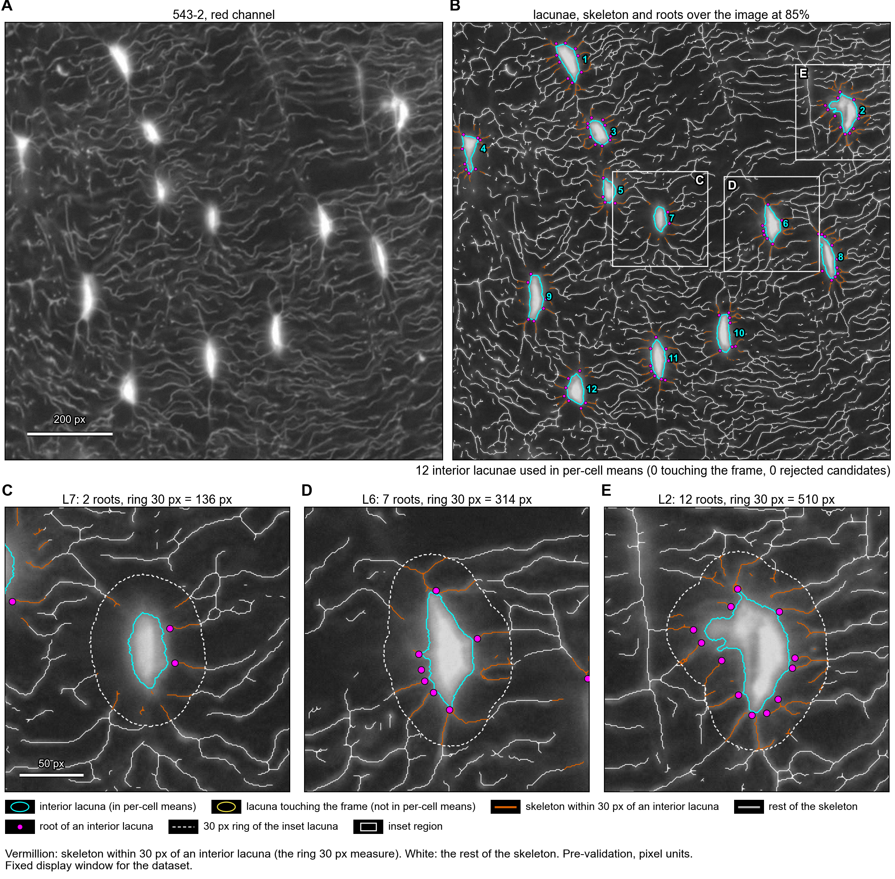
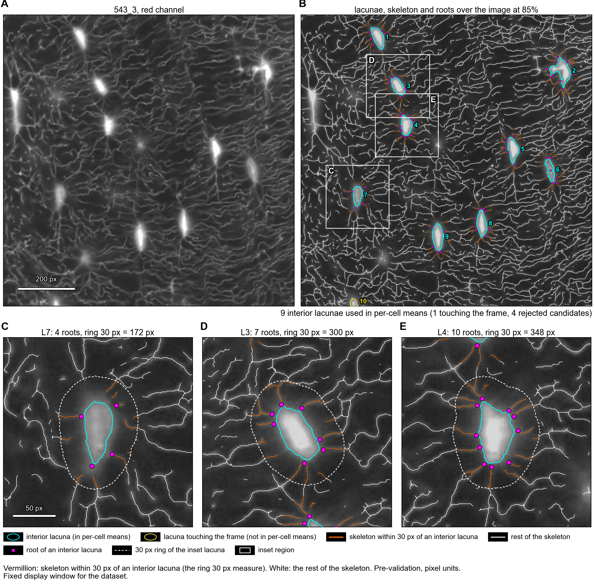
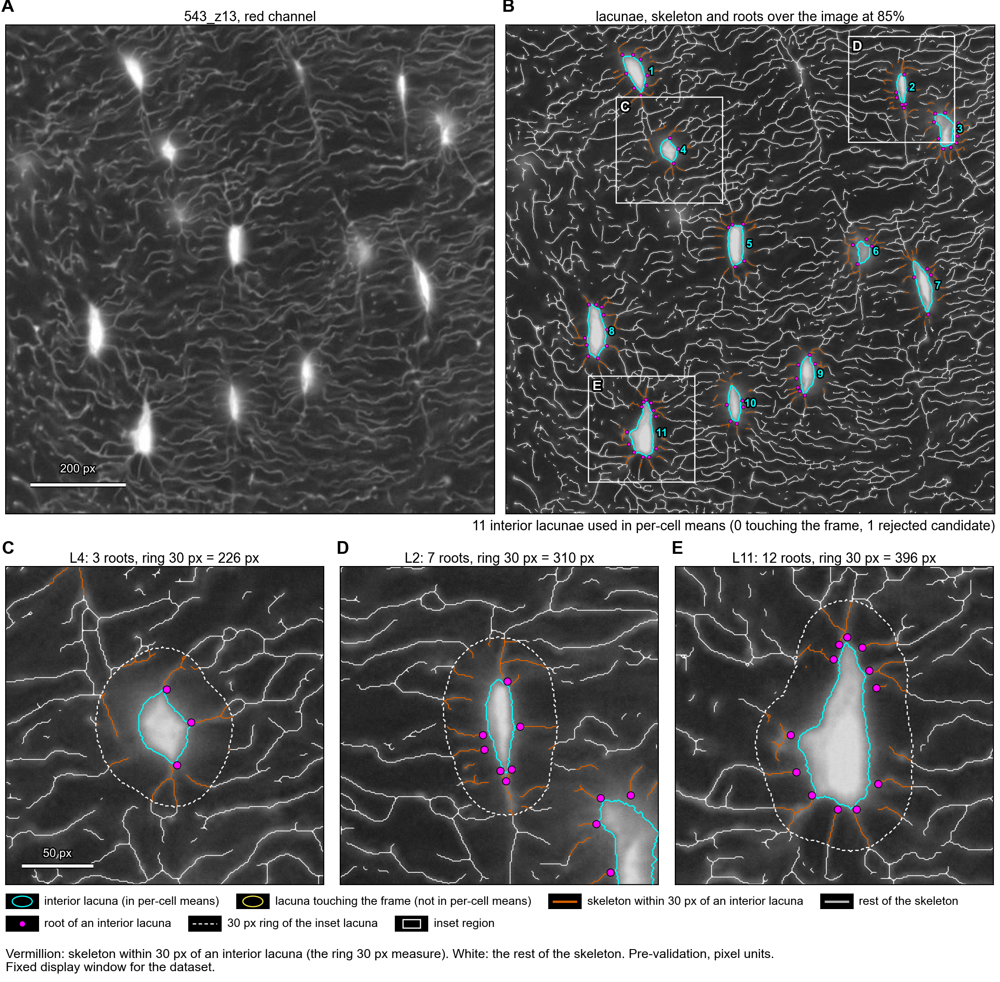
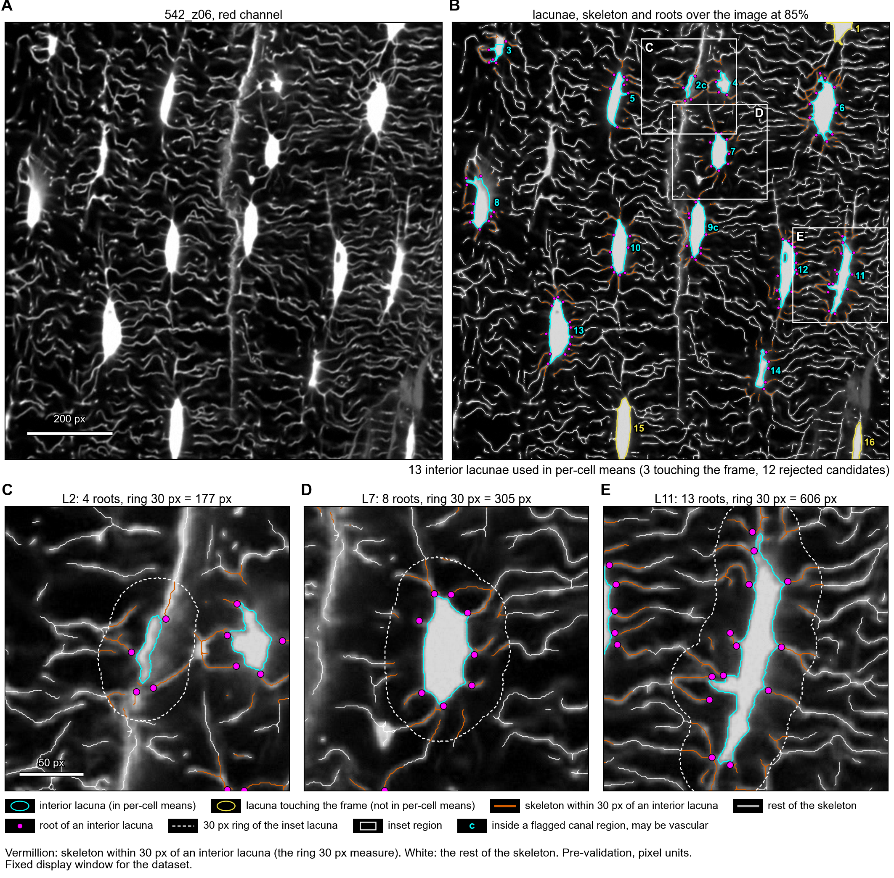
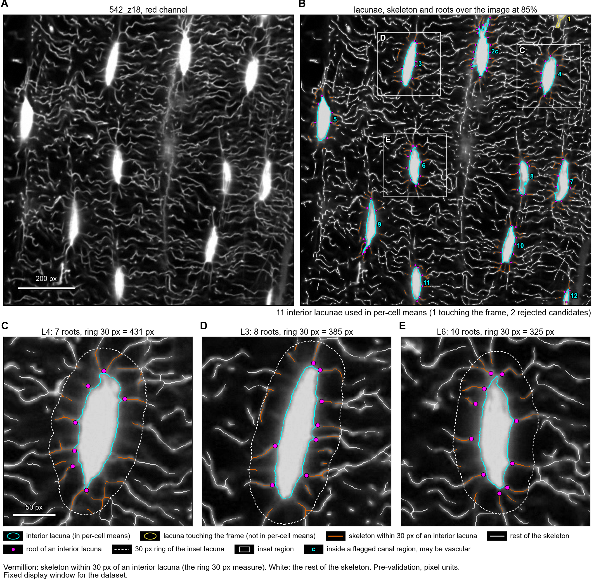
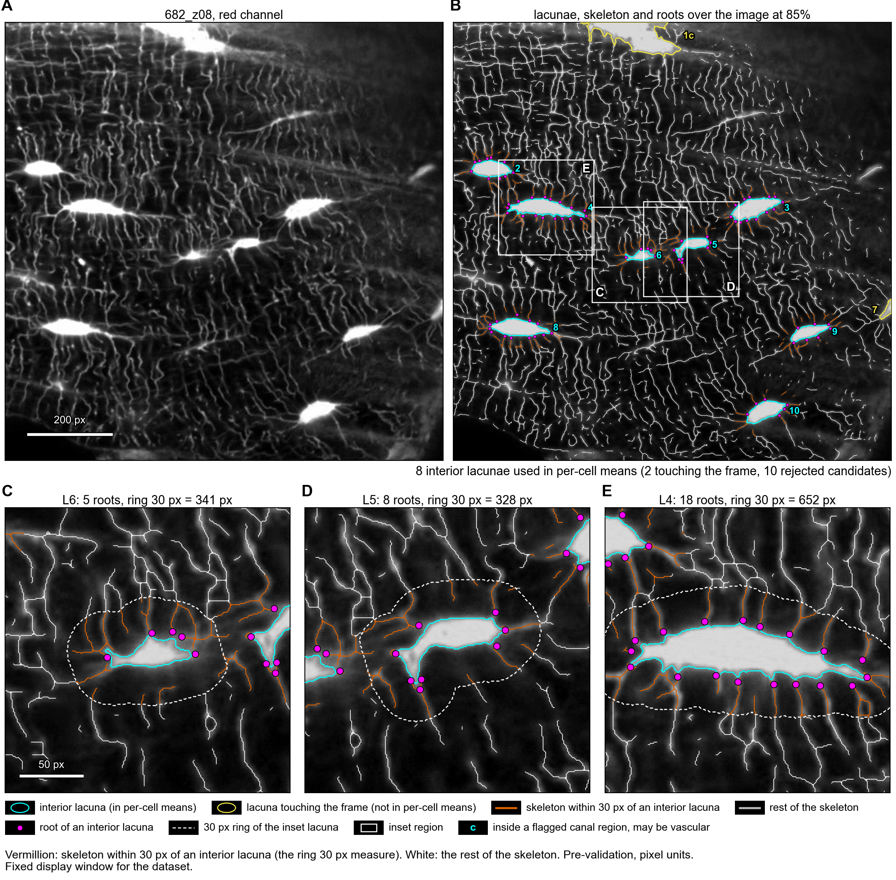
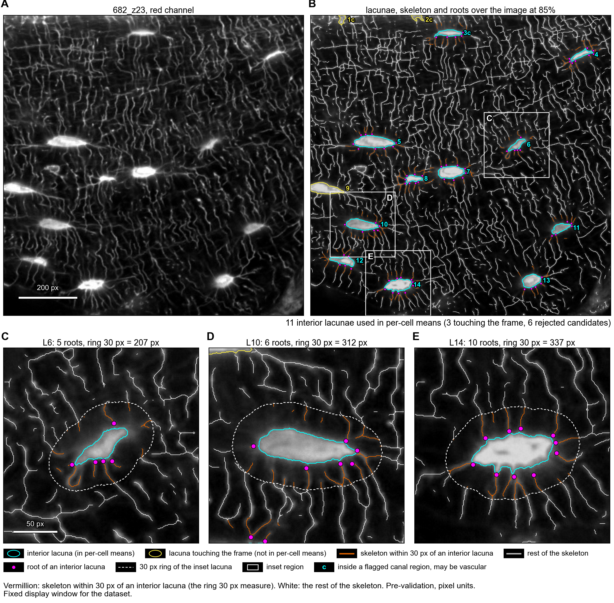
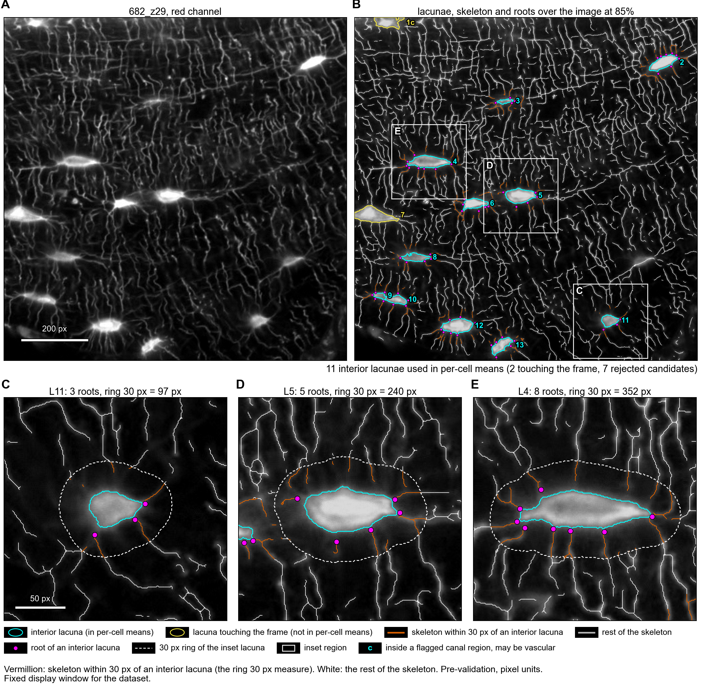

# Results

Everything the pipeline and the figure code produce, per image and for all images together.
**Pre-validation**: no number here has been checked against manual counts. **Pixel units**: the images
carry no micron scale, so lengths are px, areas px² and densities px⁻¹; no micron value is used anywhere.
The thresholds are image-relative: each image's cuts come from its own histogram. The data are 8 wild-type
(WT) sections. Method and parameters: [docs/METHODS.md](../docs/METHODS.md); where to start:
[docs/START_HERE.md](../docs/START_HERE.md).

**Detection and quantification are separate.** `src/lacunae.py` and `src/canaliculi.py` find, trace and
draw, and save what they found in `1_lacunae/` and `2_canaliculi/`. `src/quantification.py` reads that and
writes every measured number, in `5_quantification/` and in the one cross-image table. No number is
computed in two places.

## Layout

```
results/
  README.md                 this guide
  RENAMES.csv               old path and new path of every file moved by the folder change of
                            2026-10-05, which was before detection and quantification were split
  all_images/
    quantification/         quantification_all_images.csv, .xlsx and .pdf: one row per image
    figures/main/           Fig01 to Fig04
    figures/supplement/     S01 and S02
    figures/display_window.json
    archive_not_used/       kept for history, not a result (see Archive)
  <label>/                  one folder per image: 542_z06, 542_z18, 543-2, 543_3, 543_z13, 682_z08, 682_z23, 682_z29
    1_lacunae/              detection: <label>_lacunae_outlines.png, <label>_lacuna_labels.png,
                            <label>_lacunae_detection.json
    2_canaliculi/           detection: <label>_canaliculi_mask.png, _skeleton.png, _verification.png,
                            _vascular_mask.png, _bridged_pixels.png, _graph.pickle,
                            <label>_canaliculi_detection.json
    3_publication_figures/  <label>_figure_network, _figure_cell_gallery, _figure_overview (png and pdf),
                            <label>_figure_network_checks.json, _figure_cell_gallery_checks.json,
                            _figure_inset_choice.json
    4_archive_not_used/     kept for history, not a result (see Archive)
    5_quantification/       every measured number: <label>_quantification.json, .xlsx and .pdf
  validation_tiles/         tiles for counting roots by hand
```

The label is the short image name. The table from the image file name to the label is
`IMAGE_LABELS` in `config.py`; the folder and file names are defined there too.

## What each file holds

Measured numbers, all of them in `5_quantification/`:

- `<label>_quantification.json`: the counts, the interior statistics of every per-lacuna measure, the
  field block, the width block, one row per lacuna with its shape and its network measures together, the
  parameters of both detection stages, and a provenance block.
- `<label>_quantification.xlsx`: the same as the sheets `per_image`, `field`, `width`, `per_lacuna` and
  `notes`.
- `<label>_quantification.pdf`: the same to read, as plain text tables, with a histogram of lacuna areas
  and a histogram of canalicular width.
- `all_images/quantification/quantification_all_images.csv`, `.xlsx` and `.pdf`: one row per image. This
  is the only cross-image table; it replaced `summary_all_images` and keeps its columns, in the same
  order, with the width columns appended.

Detection, in `1_lacunae/` and `2_canaliculi/`:

- `<label>_lacunae_outlines.png`: the image with the kept lacunae outlined in green.
- `<label>_lacuna_labels.png`: the label image, 16-bit, 0 outside a kept lacuna and its 1..N id inside.
  Every lacuna measure is taken from this.
- `<label>_canaliculi_mask.png`: the network mask (white) before it is reduced to a skeleton.
- `<label>_canaliculi_skeleton.png`: the one-pixel skeleton of the network.
- `<label>_canaliculi_verification.png`: each kept lacuna outlined, and the threads it owns drawn 5 px
  wide, every cell in its own colour, over the full-brightness original. It is there to check the tracing
  against the real threads underneath. Its colours assign each thread to one cell through the network with
  no distance limit, so they are not one of the headline measures; the network figure shows the measured
  pixels instead.
- `<label>_canaliculi_vascular_mask.png`: the broad bright structures (vascular canals and their edges),
  already dilated. Nothing is removed from the image; hysteresis and bridging may not grow into them.
- `<label>_canaliculi_bridged_pixels.png`: the pixels gap bridging added. They have no signal under them,
  so the width measure leaves them out.
- `<label>_canaliculi_graph.pickle`: the cleaned skeleton graph with edge lengths, the node owner, its
  distance through the network and the edge owner.
- `<label>_lacunae_detection.json` and `<label>_canaliculi_detection.json`: what each stage did, with no
  measured value in them: the parameters, the cuts it computed, the bridges it added, and provenance.

Figures, in `3_publication_figures/`:

- `<label>_figure_network.png` and `.pdf`: orange is skeleton within 30 px of an interior lacuna, white is the
  rest, magenta dots are roots, cyan outlines are interior lacunae and yellow are lacunae touching the frame;
  three lacunae are shown at 3x below.
- `<label>_figure_cell_gallery.png` and `.pdf`: every interior lacuna at the same scale, with its roots and the
  dashed contour of its 30 px ring.
- `<label>_figure_overview.png` and `.pdf`: the red channel, the kept lacunae with their numbers and the
  rejected candidates, the network at small size, and one lacuna at 3x.
- `<label>_figure_network_checks.json` and `<label>_figure_cell_gallery_checks.json`: per lacuna the drawn
  root dots and ring pixels against the pipeline numbers (they are equal).
- `<label>_figure_inset_choice.json`: which lacunae the insets show and the rule that chose them.
- `all_images/figures/display_window.json`: the fixed display window used by every main figure.
- `validation_tiles/`: 86 raw tiles, one per interior lacuna, for counting roots by hand without seeing the
  pipeline result; see its README. The key is outside the repository.

## Per image

Cross-image table: [xlsx](all_images/quantification/quantification_all_images.xlsx) [csv](all_images/quantification/quantification_all_images.csv) [pdf](all_images/quantification/quantification_all_images.pdf).

| image | network figure | 5_quantification | 1_lacunae | 2_canaliculi | 3_publication_figures |
|---|---|---|---|---|---|
| **543-2** |  | [xlsx](543-2/5_quantification/543-2_quantification.xlsx) [json](543-2/5_quantification/543-2_quantification.json) [pdf](543-2/5_quantification/543-2_quantification.pdf) | [outlines png](543-2/1_lacunae/543-2_lacunae_outlines.png) [label image](543-2/1_lacunae/543-2_lacuna_labels.png) [record](543-2/1_lacunae/543-2_lacunae_detection.json) | [mask](543-2/2_canaliculi/543-2_canaliculi_mask.png) [skeleton](543-2/2_canaliculi/543-2_canaliculi_skeleton.png) [verification](543-2/2_canaliculi/543-2_canaliculi_verification.png) [vascular](543-2/2_canaliculi/543-2_canaliculi_vascular_mask.png) [bridged px](543-2/2_canaliculi/543-2_canaliculi_bridged_pixels.png) [graph](543-2/2_canaliculi/543-2_canaliculi_graph.pickle) [record](543-2/2_canaliculi/543-2_canaliculi_detection.json) | [network png](543-2/3_publication_figures/543-2_figure_network.png) [pdf](543-2/3_publication_figures/543-2_figure_network.pdf) [cell gallery png](543-2/3_publication_figures/543-2_figure_cell_gallery.png) [pdf](543-2/3_publication_figures/543-2_figure_cell_gallery.pdf) [overview png](543-2/3_publication_figures/543-2_figure_overview.png) [pdf](543-2/3_publication_figures/543-2_figure_overview.pdf) [network checks](543-2/3_publication_figures/543-2_figure_network_checks.json) [gallery checks](543-2/3_publication_figures/543-2_figure_cell_gallery_checks.json) [inset choice](543-2/3_publication_figures/543-2_figure_inset_choice.json) |
| **543_3** |  | [xlsx](543_3/5_quantification/543_3_quantification.xlsx) [json](543_3/5_quantification/543_3_quantification.json) [pdf](543_3/5_quantification/543_3_quantification.pdf) | [outlines png](543_3/1_lacunae/543_3_lacunae_outlines.png) [label image](543_3/1_lacunae/543_3_lacuna_labels.png) [record](543_3/1_lacunae/543_3_lacunae_detection.json) | [mask](543_3/2_canaliculi/543_3_canaliculi_mask.png) [skeleton](543_3/2_canaliculi/543_3_canaliculi_skeleton.png) [verification](543_3/2_canaliculi/543_3_canaliculi_verification.png) [vascular](543_3/2_canaliculi/543_3_canaliculi_vascular_mask.png) [bridged px](543_3/2_canaliculi/543_3_canaliculi_bridged_pixels.png) [graph](543_3/2_canaliculi/543_3_canaliculi_graph.pickle) [record](543_3/2_canaliculi/543_3_canaliculi_detection.json) | [network png](543_3/3_publication_figures/543_3_figure_network.png) [pdf](543_3/3_publication_figures/543_3_figure_network.pdf) [cell gallery png](543_3/3_publication_figures/543_3_figure_cell_gallery.png) [pdf](543_3/3_publication_figures/543_3_figure_cell_gallery.pdf) [overview png](543_3/3_publication_figures/543_3_figure_overview.png) [pdf](543_3/3_publication_figures/543_3_figure_overview.pdf) [network checks](543_3/3_publication_figures/543_3_figure_network_checks.json) [gallery checks](543_3/3_publication_figures/543_3_figure_cell_gallery_checks.json) [inset choice](543_3/3_publication_figures/543_3_figure_inset_choice.json) |
| **543_z13** |  | [xlsx](543_z13/5_quantification/543_z13_quantification.xlsx) [json](543_z13/5_quantification/543_z13_quantification.json) [pdf](543_z13/5_quantification/543_z13_quantification.pdf) | [outlines png](543_z13/1_lacunae/543_z13_lacunae_outlines.png) [label image](543_z13/1_lacunae/543_z13_lacuna_labels.png) [record](543_z13/1_lacunae/543_z13_lacunae_detection.json) | [mask](543_z13/2_canaliculi/543_z13_canaliculi_mask.png) [skeleton](543_z13/2_canaliculi/543_z13_canaliculi_skeleton.png) [verification](543_z13/2_canaliculi/543_z13_canaliculi_verification.png) [vascular](543_z13/2_canaliculi/543_z13_canaliculi_vascular_mask.png) [bridged px](543_z13/2_canaliculi/543_z13_canaliculi_bridged_pixels.png) [graph](543_z13/2_canaliculi/543_z13_canaliculi_graph.pickle) [record](543_z13/2_canaliculi/543_z13_canaliculi_detection.json) | [network png](543_z13/3_publication_figures/543_z13_figure_network.png) [pdf](543_z13/3_publication_figures/543_z13_figure_network.pdf) [cell gallery png](543_z13/3_publication_figures/543_z13_figure_cell_gallery.png) [pdf](543_z13/3_publication_figures/543_z13_figure_cell_gallery.pdf) [overview png](543_z13/3_publication_figures/543_z13_figure_overview.png) [pdf](543_z13/3_publication_figures/543_z13_figure_overview.pdf) [network checks](543_z13/3_publication_figures/543_z13_figure_network_checks.json) [gallery checks](543_z13/3_publication_figures/543_z13_figure_cell_gallery_checks.json) [inset choice](543_z13/3_publication_figures/543_z13_figure_inset_choice.json) |
| **542_z06** |  | [xlsx](542_z06/5_quantification/542_z06_quantification.xlsx) [json](542_z06/5_quantification/542_z06_quantification.json) [pdf](542_z06/5_quantification/542_z06_quantification.pdf) | [outlines png](542_z06/1_lacunae/542_z06_lacunae_outlines.png) [label image](542_z06/1_lacunae/542_z06_lacuna_labels.png) [record](542_z06/1_lacunae/542_z06_lacunae_detection.json) | [mask](542_z06/2_canaliculi/542_z06_canaliculi_mask.png) [skeleton](542_z06/2_canaliculi/542_z06_canaliculi_skeleton.png) [verification](542_z06/2_canaliculi/542_z06_canaliculi_verification.png) [vascular](542_z06/2_canaliculi/542_z06_canaliculi_vascular_mask.png) [bridged px](542_z06/2_canaliculi/542_z06_canaliculi_bridged_pixels.png) [graph](542_z06/2_canaliculi/542_z06_canaliculi_graph.pickle) [record](542_z06/2_canaliculi/542_z06_canaliculi_detection.json) | [network png](542_z06/3_publication_figures/542_z06_figure_network.png) [pdf](542_z06/3_publication_figures/542_z06_figure_network.pdf) [cell gallery png](542_z06/3_publication_figures/542_z06_figure_cell_gallery.png) [pdf](542_z06/3_publication_figures/542_z06_figure_cell_gallery.pdf) [overview png](542_z06/3_publication_figures/542_z06_figure_overview.png) [pdf](542_z06/3_publication_figures/542_z06_figure_overview.pdf) [network checks](542_z06/3_publication_figures/542_z06_figure_network_checks.json) [gallery checks](542_z06/3_publication_figures/542_z06_figure_cell_gallery_checks.json) [inset choice](542_z06/3_publication_figures/542_z06_figure_inset_choice.json) |
| **542_z18** |  | [xlsx](542_z18/5_quantification/542_z18_quantification.xlsx) [json](542_z18/5_quantification/542_z18_quantification.json) [pdf](542_z18/5_quantification/542_z18_quantification.pdf) | [outlines png](542_z18/1_lacunae/542_z18_lacunae_outlines.png) [label image](542_z18/1_lacunae/542_z18_lacuna_labels.png) [record](542_z18/1_lacunae/542_z18_lacunae_detection.json) | [mask](542_z18/2_canaliculi/542_z18_canaliculi_mask.png) [skeleton](542_z18/2_canaliculi/542_z18_canaliculi_skeleton.png) [verification](542_z18/2_canaliculi/542_z18_canaliculi_verification.png) [vascular](542_z18/2_canaliculi/542_z18_canaliculi_vascular_mask.png) [bridged px](542_z18/2_canaliculi/542_z18_canaliculi_bridged_pixels.png) [graph](542_z18/2_canaliculi/542_z18_canaliculi_graph.pickle) [record](542_z18/2_canaliculi/542_z18_canaliculi_detection.json) | [network png](542_z18/3_publication_figures/542_z18_figure_network.png) [pdf](542_z18/3_publication_figures/542_z18_figure_network.pdf) [cell gallery png](542_z18/3_publication_figures/542_z18_figure_cell_gallery.png) [pdf](542_z18/3_publication_figures/542_z18_figure_cell_gallery.pdf) [overview png](542_z18/3_publication_figures/542_z18_figure_overview.png) [pdf](542_z18/3_publication_figures/542_z18_figure_overview.pdf) [network checks](542_z18/3_publication_figures/542_z18_figure_network_checks.json) [gallery checks](542_z18/3_publication_figures/542_z18_figure_cell_gallery_checks.json) [inset choice](542_z18/3_publication_figures/542_z18_figure_inset_choice.json) |
| **682_z08** |  | [xlsx](682_z08/5_quantification/682_z08_quantification.xlsx) [json](682_z08/5_quantification/682_z08_quantification.json) [pdf](682_z08/5_quantification/682_z08_quantification.pdf) | [outlines png](682_z08/1_lacunae/682_z08_lacunae_outlines.png) [label image](682_z08/1_lacunae/682_z08_lacuna_labels.png) [record](682_z08/1_lacunae/682_z08_lacunae_detection.json) | [mask](682_z08/2_canaliculi/682_z08_canaliculi_mask.png) [skeleton](682_z08/2_canaliculi/682_z08_canaliculi_skeleton.png) [verification](682_z08/2_canaliculi/682_z08_canaliculi_verification.png) [vascular](682_z08/2_canaliculi/682_z08_canaliculi_vascular_mask.png) [bridged px](682_z08/2_canaliculi/682_z08_canaliculi_bridged_pixels.png) [graph](682_z08/2_canaliculi/682_z08_canaliculi_graph.pickle) [record](682_z08/2_canaliculi/682_z08_canaliculi_detection.json) | [network png](682_z08/3_publication_figures/682_z08_figure_network.png) [pdf](682_z08/3_publication_figures/682_z08_figure_network.pdf) [cell gallery png](682_z08/3_publication_figures/682_z08_figure_cell_gallery.png) [pdf](682_z08/3_publication_figures/682_z08_figure_cell_gallery.pdf) [overview png](682_z08/3_publication_figures/682_z08_figure_overview.png) [pdf](682_z08/3_publication_figures/682_z08_figure_overview.pdf) [network checks](682_z08/3_publication_figures/682_z08_figure_network_checks.json) [gallery checks](682_z08/3_publication_figures/682_z08_figure_cell_gallery_checks.json) [inset choice](682_z08/3_publication_figures/682_z08_figure_inset_choice.json) |
| **682_z23** |  | [xlsx](682_z23/5_quantification/682_z23_quantification.xlsx) [json](682_z23/5_quantification/682_z23_quantification.json) [pdf](682_z23/5_quantification/682_z23_quantification.pdf) | [outlines png](682_z23/1_lacunae/682_z23_lacunae_outlines.png) [label image](682_z23/1_lacunae/682_z23_lacuna_labels.png) [record](682_z23/1_lacunae/682_z23_lacunae_detection.json) | [mask](682_z23/2_canaliculi/682_z23_canaliculi_mask.png) [skeleton](682_z23/2_canaliculi/682_z23_canaliculi_skeleton.png) [verification](682_z23/2_canaliculi/682_z23_canaliculi_verification.png) [vascular](682_z23/2_canaliculi/682_z23_canaliculi_vascular_mask.png) [bridged px](682_z23/2_canaliculi/682_z23_canaliculi_bridged_pixels.png) [graph](682_z23/2_canaliculi/682_z23_canaliculi_graph.pickle) [record](682_z23/2_canaliculi/682_z23_canaliculi_detection.json) | [network png](682_z23/3_publication_figures/682_z23_figure_network.png) [pdf](682_z23/3_publication_figures/682_z23_figure_network.pdf) [cell gallery png](682_z23/3_publication_figures/682_z23_figure_cell_gallery.png) [pdf](682_z23/3_publication_figures/682_z23_figure_cell_gallery.pdf) [overview png](682_z23/3_publication_figures/682_z23_figure_overview.png) [pdf](682_z23/3_publication_figures/682_z23_figure_overview.pdf) [network checks](682_z23/3_publication_figures/682_z23_figure_network_checks.json) [gallery checks](682_z23/3_publication_figures/682_z23_figure_cell_gallery_checks.json) [inset choice](682_z23/3_publication_figures/682_z23_figure_inset_choice.json) |
| **682_z29** |  | [xlsx](682_z29/5_quantification/682_z29_quantification.xlsx) [json](682_z29/5_quantification/682_z29_quantification.json) [pdf](682_z29/5_quantification/682_z29_quantification.pdf) | [outlines png](682_z29/1_lacunae/682_z29_lacunae_outlines.png) [label image](682_z29/1_lacunae/682_z29_lacuna_labels.png) [record](682_z29/1_lacunae/682_z29_lacunae_detection.json) | [mask](682_z29/2_canaliculi/682_z29_canaliculi_mask.png) [skeleton](682_z29/2_canaliculi/682_z29_canaliculi_skeleton.png) [verification](682_z29/2_canaliculi/682_z29_canaliculi_verification.png) [vascular](682_z29/2_canaliculi/682_z29_canaliculi_vascular_mask.png) [bridged px](682_z29/2_canaliculi/682_z29_canaliculi_bridged_pixels.png) [graph](682_z29/2_canaliculi/682_z29_canaliculi_graph.pickle) [record](682_z29/2_canaliculi/682_z29_canaliculi_detection.json) | [network png](682_z29/3_publication_figures/682_z29_figure_network.png) [pdf](682_z29/3_publication_figures/682_z29_figure_network.pdf) [cell gallery png](682_z29/3_publication_figures/682_z29_figure_cell_gallery.png) [pdf](682_z29/3_publication_figures/682_z29_figure_cell_gallery.pdf) [overview png](682_z29/3_publication_figures/682_z29_figure_overview.png) [pdf](682_z29/3_publication_figures/682_z29_figure_overview.pdf) [network checks](682_z29/3_publication_figures/682_z29_figure_network_checks.json) [gallery checks](682_z29/3_publication_figures/682_z29_figure_cell_gallery_checks.json) [inset choice](682_z29/3_publication_figures/682_z29_figure_inset_choice.json) |

## The measures

The headline measures are roots per cell, ring length 30 px, the per-field length density and the
canalicular width. Definitions, origins and limits: [docs/METHODS.md](../docs/METHODS.md) section 3.
`owned_length_px`, `edge_count` and `mean_edge_length_px` depend on which cell owns which thread, with no
distance limit, so every output labels them ownership-dependent.

### Canalicular width, added with this layout

- `width_mean_px`, `width_median_px`, `width_p10_px`, `width_p90_px`, `width_pixels_used` (per image) and
  `ring_width_mean_r30_px` (per lacuna, over its own 30 px ring): twice the Euclidean distance transform
  of the canalicular mask at each skeleton pixel, so the local full width of a thread, in px.
- Measured only where there is real signal under the skeleton. The pixels gap bridging added, the lacuna
  buffer and the dilated vascular mask are left out.
- The threads are only about 2 to 6 px wide, so the width sits close to the pixel grid and is quantised in
  steps of about 1 px. It moves with the threshold, because a lower cut widens every thread. It is **not
  validated** against any manual width measurement.

### Columns added earlier

The existing columns and values have never changed. From `docs/METHODS.md` (section 9), per lacuna, and as
interior means in the cross-image table:

- `perimeter_px`: regionprops perimeter of the lacuna, $P$.
- `ring_area_r30_px2`, `ring_area_r60_px2`: $A_r$, pixels of the nearest-lacuna partition within $r$ px of
  the body, lacunae excluded.
- `in_frame_fraction_r30`, `in_frame_fraction_r60`: in-frame share of the full $r$ px annulus around this
  lacuna alone.
- `ring_density_r30`, `ring_density_r60`: $L_r / A_r$, with $L_r$ the ring length (px⁻¹).
- `roots_per_100px_perimeter`: $100 \cdot \text{roots} / P$.

`docs/METHODS.md` does not define the next columns yet; their definitions are those of
[docs/reports/CANALICULI_V2_REPORT.md](../docs/reports/CANALICULI_V2_REPORT.md) (section "New columns"):

- `ring_attached_length_r30_px`, `ring_attached_length_r60_px`: ring length pixels (same pixel set as
  `ring_length_rR_px`) in 8-connected components of the ring that reach within 10 px of the lacuna.
- `ring_length_w_r30_px`, `ring_length_w_r60_px`: chain code length of the ring, 1 per orthogonal link and
  $\sqrt{2}$ per diagonal link.
- `sholl_crossings_r10`, `sholl_crossings_r20`, `sholl_crossings_r30`: 8-connected skeleton components inside
  the band $[R - 0.75, R + 0.75)$ px from the lacuna, in its nearest-lacuna partition.
- `field_length_density_w_per_px` (field): chain code length of the skeleton over the analysed area.
- `field_density_without_flagged_per_px` (field): skeleton px outside the flagged canal mask over the
  analysed area outside it.
- `field_density_in_roi_per_px` (field): skeleton px inside a bone ROI over the analysed area inside it; only
  with the `-m` option of `src/quantification.py`, empty otherwise.
- `image_label`: the short image name used in the folder and file names.

## Figures for all images

In `all_images/figures/` (fixed display window for the dataset):

- Fig01_contact_sheet: All 8 WT sections with the kept lacunae, the canal marks and the count lines. [png](all_images/figures/main/Fig01_contact_sheet.png) [pdf](all_images/figures/main/Fig01_contact_sheet.pdf)
- Fig02_network_overlay_543-2: Network overlay of 543-2, a copy of its network figure. [png](all_images/figures/main/Fig02_network_overlay_543-2.png) [pdf](all_images/figures/main/Fig02_network_overlay_543-2.pdf)
- Fig03_threshold_sensitivity: Lacuna count against the lacuna threshold, three sections at 0.8 to 1.2 times the cut. [png](all_images/figures/main/Fig03_threshold_sensitivity.png) [pdf](all_images/figures/main/Fig03_threshold_sensitivity.pdf)
- Fig04_per_field: Per-cell and per-field measures by field, y axes from zero. [png](all_images/figures/main/Fig04_per_field.png) [pdf](all_images/figures/main/Fig04_per_field.pdf)
- Fig04_per_field_merged: The same with 682_z08 merged by hand into Field 4. [png](all_images/figures/main/Fig04_per_field_merged.png) [pdf](all_images/figures/main/Fig04_per_field_merged.pdf)
- S01_switch_examples: Two optional switches, off (default) and on. [png](all_images/figures/supplement/S01_switch_examples.png) [pdf](all_images/figures/supplement/S01_switch_examples.pdf)
- S02_contact_sheet_with_rejected_candidates: The contact sheet with the rejected lacuna-scale candidates. [png](all_images/figures/supplement/S02_contact_sheet_with_rejected_candidates.png) [pdf](all_images/figures/supplement/S02_contact_sheet_with_rejected_candidates.pdf)

Captions: [figures/captions.md](../figures/captions.md).

## How to regenerate

From the repository root, with the project's Python, in this order:

```
python src/lacunae.py --dir data/WT          # 1_lacunae of every image
python src/canaliculi.py --dir data/WT       # 2_canaliculi of every image
python src/quantification.py --dir data/WT   # 5_quantification and the cross-image table
python -u figures/make_figures.py all        # every figure; existing figures are skipped
python src/diagnostics.py reference-check    # must PASS: 62.33 / 27.41 / 21 on 543-2
python src/diagnostics.py regression         # every number against results/, tolerance 0
```

`results/` is the reference that `regression` compares with, so regenerate it only on purpose.
The option `-o OTHER_FOLDER` writes the same layout into another folder.

## Archive

The folders `<label>/4_archive_not_used/` and `all_images/archive_not_used/` hold images kept only for
history: the per-image brightness variants of the figures; the low-cut overview layer of 543_3; and the
coded contact sheet used to test blinding. They are not part of the results, and no figure or table uses
them.
